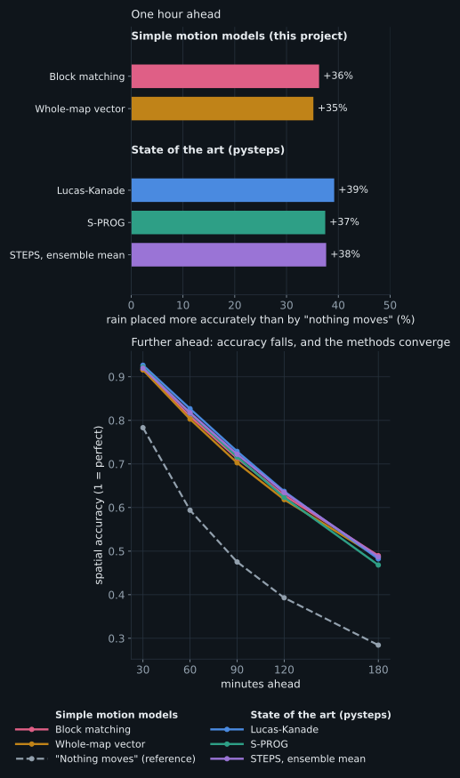

# Denmark-rain-nowcast

**A benchmark of rain-nowcasting methods against real radar observations over Denmark.**

Six months of Danish weather-radar data (2026-04-01 to 2026-09-23, {{n:fullrange}} full-range scans, one every 10 minutes) are used to test how well different methods forecast rain over the next minutes to hours: a "nothing moves" reference, simple motion-extrapolation models written for this project, and the open-source state of the art, [pysteps](https://pysteps.github.io). Every method is run as a hindcast on identical inputs and scored against the radar that followed, over {{n:units}} rain episodes.

**The short version** is a blog post, the project's web page: [`docs/index.html`](docs/index.html) (built from [`docs/BLOG.md`](docs/BLOG.md); with GitHub Pages serving the `docs/` folder, it is the site's front page).

**The full report: [`docs/REPORT.md`](docs/REPORT.md).** It starts with a plain-language summary and explains the terms as it goes.

## Findings in brief

- **pysteps' Lucas-Kanade method is the best single forecast up to 2 hours:** it improves on "nothing moves" by {{d:pysteps-lk:60}} in the main score (FSS) at +60 minutes, against {{d:bw7:60}} for block matching and {{d:gw4:60}} for one motion vector for the whole map (each at its best amount of history), and is better in {{pw:pysteps-lk:bw7:60}} of rain events. By +3 hours they are level.
- **The two simple methods are close:** one vector per map block and one vector for the whole map are within about 0.01 of each other at every lead time; block matching forecasts more excess rain at long leads.
- **For block matching, the gap between the matched scans matters:** scans 5 minutes apart cut its gain at +60 minutes from {{d@c10:block:60}} to {{d@c5:block:60}} on the same area and moments. pysteps is not affected. With 10-minute scans, more history adds little.
- **For probabilities, pysteps' STEPS ensemble is clearly best.** Every method gains in every month; skill fades with lead time. Six months is one season; there is no winter data.
- **Radar data:** DMI alternates a full-range and a short-range scan every 5 minutes; the benchmark uses the full-range scans and treats areas without radar data as missing (report, Appendix A.1).



## What is here

| Path | What |
|---|---|
| `docs/REPORT.md` | The report (generated from `docs/REPORT.template.md` and `results/`) |
| `docs/figures/` | Schematics and result figures |
| `src/nowcastlab/` | Radar reading, the archive's time axis, motion estimation, all forecasting methods, hindcast harness, scores, report tables |
| `scripts/` | Download, benchmark, figure, report and page builders |
| `results/` | Scored forecasts and the tables built from them |
| `tests/` | Unit tests, plus tests that the Python models reproduce the original JavaScript |
| `legacy/`, `data/legacy/` | The original JavaScript implementation and data the project grew out of |

## Reproducing the results

Requires Python 3.11+, about 12 GB of disk for the radar archive, and about an hour on a 12-core machine for the benchmark runs.

```
python3 -m venv .venv && . .venv/bin/activate
pip install -e . pytest pysteps opencv-python-headless markdown cairosvg
python scripts/backfill.py 2026-04-01 2026-09-23   # download DMI radar scans (open API, no key)
python scripts/build_index.py
pytest
```

The commands for the benchmark runs, figures and report are in Appendix E of the report.

## Data and credits

Radar data: Danish Meteorological Institute (DMI) Open Data; check DMI's terms of use before redistributing. The `data/` directory is not part of the repository. State-of-the-art methods: pysteps (Pulkkinen et al., 2019, *Geoscientific Model Development* 12, 4185-4219). Coastlines in the map figures: Natural Earth (public domain).
