# Rain nowcasting in Denmark: simple motion models against the state of the art

*Phone apps say "rain in 20 minutes". This report looks at how such short-range forecasts are made from weather radar, and how simple they can be. Tested on six months of Danish radar, 2026-04-01 to 2026-09-23, a simple method gets within a few percent of the state of the art.*

## Summary

**The question.** A rain *nowcast* predicts where it will rain over the next minutes to hours, usually by taking the latest radar images and moving the rain along. This project asks four questions: does moving the rain help, how close do simple methods come to a state-of-the-art system (the open-source library [pysteps](https://pysteps.github.io)), why is a simple method enough over Denmark, and can a single forecast also give an honest chance of rain at one spot?

**How it was tested.** Every method was run as a *hindcast*: pretend it is a moment in the past, give the method only the radar scans up to that moment, forecast, then compare with the scans that followed. This was repeated at 1,649 moments in 157 rainy periods, with identical inputs for every method, and each forecast was scored from 30 minutes to 3 hours ahead.

**The methods.** Two *simple motion models* were built for this project. Both measure how the rain moved between the latest radar scans and carry it on along that motion: *block matching* gives each square of the map, about 26 km across, its own motion, and the *whole-map vector* moves all the rain with one shared motion. They are compared with three pysteps methods: Lucas-Kanade optical flow, which measures the motion at every point of the map, S-PROG, and the STEPS ensemble, which also gives the chance of rain. The reference is *persistence*: the latest radar picture, unchanged ("nothing moves").

**What was found.**

1. **Moving the rain pays off.** One hour ahead, the simple motion models place rain 35% to 36% more accurately than "nothing moves", and pysteps' Lucas-Kanade 39%.
2. **The state of the art is ahead, but only a little.** One hour ahead, Lucas-Kanade places rain 2% more accurately than the better simple model, block matching, and does better in 86% of the rainy periods. Three hours ahead all the methods are level.
3. **Over Denmark, one motion for the whole map is nearly enough.** The two simple models differ by at most about 2% at any lead time: over flat Denmark the rain moves nearly the same way within about 50 km.
4. **Accuracy fades with time.** For every method it roughly halves between 30 minutes and three hours ahead (bottom of the chart): rain that forms or dies, which none of them can forecast, takes over.
5. **One forecast can also give an honest chance of rain.** STEPS gives the best chances, but one ordinary forecast, read with an uncertainty that grows with lead time, comes within a few percent, both for rain at a given moment and for when rain starts or stops at one spot (section 5.5).
6. **The conclusions hold up** in every month, without the radar's known flaws, and with settings chosen on held-out months (section 6).


*Reading the chart:* warm colours are the simple motion models built for this project, cool colours the state of the art (pysteps). Top: one hour ahead, how much more accurately each method places rain than "nothing moves". Bottom: spatial accuracy from 30 minutes to 3 hours ahead (1 is perfect), with "nothing moves" dashed.

## 1. What a rain nowcast is

Weather radar scans the sky every few minutes and, after conversion, gives a map of rain rate in millimetres per hour. Over the next hour or two, the best predictor of that map is usually *the same map with the rain moved along*, not a full physics-based weather model, which is too slow and too coarse to track individual showers. Methods that do this are called *extrapolation nowcasts*. They all have two parts:

1. **Measure the motion** of the rain from recent scans.
2. **Move the rain forward** along that motion, one time step at a time.

They cannot predict rain starting, growing, or dying; only movement. The methods compared here differ almost entirely in the first part: how the motion is measured.

**Tested:** "nothing moves" as the reference; the two simple motion models built for this project; and three methods from **pysteps**, a widely used research library. Section 4 describes them.

**Words used.** A few terms recur; all are also in the glossary (Appendix F).

- *Lead time*: how far ahead a forecast looks, "+60 minutes" meaning one hour ahead.
- *Hindcast*: a forecast made for a moment in the past, using only the radar scans up to that moment.
- *Cell*: the radar map is divided into cells of about 3.2 km on each side. A *block* is a square of 8 x 8 cells, about 26 km across.
- *Rain episode*: a rainy period of at most 12 hours; the unit of evidence (section 3.1).
- *Spatial accuracy* (FSS): how well a forecast puts rain in the right place, judged over about 30 km (section 3.2).

## 2. Data

- **Radar.** The composite of DMI's five weather radars covering Denmark, from DMI's open data API: one full-range scan every 10 minutes (Appendix A.1).
- **Period.** 2026-04-01 to 2026-09-23, 176 days, 25,300 scans.
- **Map.** Rain rate in mm/h on cells of about 3.2 km (224 x 160 cells). The map is wider than Denmark so that rain can be tracked in from the sea; scores are computed only over Denmark and its waters, the *scoring area*. Appendix A gives the details.
- **Known flaws.** The radar is an estimate of the rain, not a measurement of it. At a few spots, most clearly at Copenhagen, it shows light rain that never moves, an echo from structures, and its five radars disagree on amounts (Appendices A.3 and A.4). Every method is scored against the same radar, so this favours none of them.

## 3. How the methods are tested

### 3.1 Hindcasts and rain episodes

At each *issue time* a method receives the last few scans (never later ones) and forecasts every 10 minutes ahead; the forecast for +60 minutes is compared with the scan 60 minutes later. Every method sees exactly the same issue times and scans.

Hindcasts are run only while it rains. The rainy hours (rain on at least 2% of the scoring area) are grouped into *rain episodes*: a dry break of less than an hour does not end an episode, an episode shorter than an hour or never covering 5% of the area is left out, and an episode longer than 12 hours is cut into pieces of at most 12 hours. Inside each episode a hindcast is issued every hour: 1,649 hindcasts in 157 episodes.

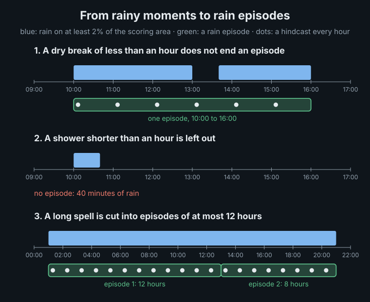

Hindcasts from one episode share its weather, so the episode, not the single hindcast, counts as one independent piece of evidence. And because only rainy moments are scored, the results say how well each method moves rain that is already on the map; when the whole map is dry there is nothing to move.

### 3.2 Scores

| Score | What it measures | Better is |
|---|---|---|
| **FSS**, fractions skill score | **Spatial accuracy.**<br>Does the forecast put rain (at least 0.5 mm/h) in the right neighbourhood? For every cell, the share of wet cells within 9 x 9 cells (about 30 km) is compared between forecast and radar, so a shower forecast a few cells off still scores. The report mostly gives it as *how much more accurately* a method places rain than "nothing moves": +35% means an FSS 35% higher. | higher; 1 is perfect |
| **Rain ratio** | **Amount.**<br>Total forecast rain divided by total observed rain. | closest to 1 |
| **Brier score** | **Chance of rain.**<br>Each cell gets a forecast chance of rain, checked against what happened: a 90% chance scores well where it rained and badly where it stayed dry. Given as the improvement over "nothing moves". | higher |

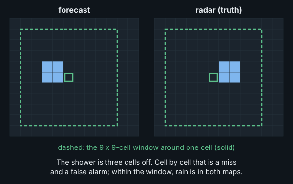

### 3.3 Uncertainty

Every score comes from a limited sample of rain, 157 rain episodes, so each is given with a *95% interval*: the range it would very likely fall in with another six months of similar rain. For example, one hour ahead pysteps Lucas-Kanade places rain 39% more accurately than "nothing moves", with an interval of 34% to 46%. When two methods are compared, the interval is for their difference: if it does not include 0, the difference is statistically significant. Appendix D.1 explains how the intervals are made.

## 4. The methods

**What the methods rely on.** Rain is carried by the wind at the height of its clouds. Over Denmark it moves with the wind about 3 km up, typically at 40 km/h toward the east or north-east. That wind changes slowly, typically by 4 km/h in an hour, and over flat Denmark it is nearly the same everywhere within about 50 km (Appendices B.1, B.3 and B.4). So a motion measured on the last few scans can move the rain forward for an hour or more. What no method can foresee is rain forming, growing or dying out on the way.

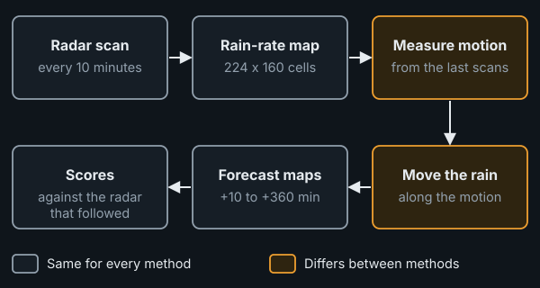

### 4.1 Persistence

The reference: the latest scan, unchanged. A method has skill only if it beats this.

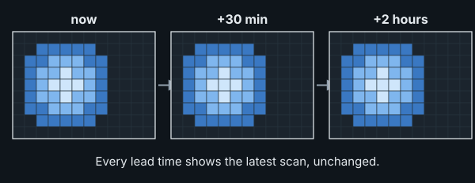

### 4.2 Block matching, one vector per block

Each 8 x 8-cell block of the older scan (about 26 x 26 km) is searched for in the newer one, up to 6 cells (about 19 km) away in every direction. With scans 10 minutes apart, that covers rain moving at up to about 115 km/h, well above the typical 40 km/h. The shift that fits best is that block's motion, and its confidence is how much better it fits than no shift. Blocks with low confidence borrow from confident neighbours, and empty blocks over dry ground are filled from their neighbours, so rain keeps moving where the measurement ends. Each block's motion is averaged over the scan pairs of the last hour, which calms the noise of single matches (Appendix B.1).

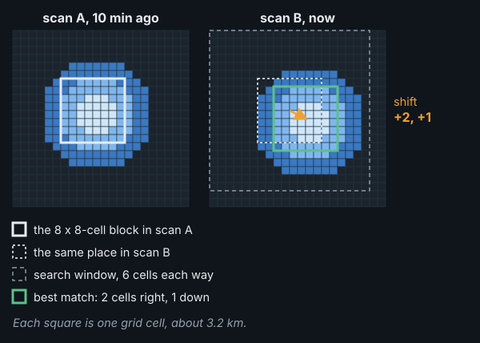

**Why 8 x 8 cells.** A block must hold enough rain pattern to be found again in the next scan, and blocks of 4 x 4 cells (13 km) already match unreliably. It must also be small enough that the rain inside it moves the same way. Blocks from 26 to about 100 km score about the same (Appendix B.3); 26 km keeps the most local detail.

### 4.3 The whole-map vector

The whole-map vector starts from the same block matches, but combines them into one motion for the whole map: the average of the blocks' matches, weighted by their confidence, and over the scan pairs of the last 30 minutes. One vector cannot follow rain moving in different directions in different places, as it can around a low-pressure system; but it never pulls neighbouring parts of the rain apart, as differing block vectors sometimes do (Appendix B.5).

In the figure, each arrow on the upper map is one block's vector, drawn inside that block's outline (every other block is shown, over rain only); the lower map shows the single whole-map vector. Arrow lengths are to scale with each other.

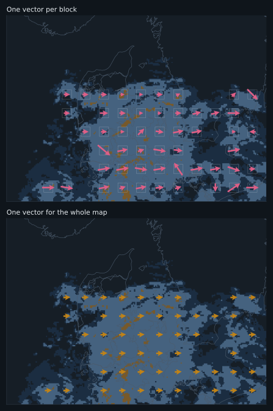

### 4.4 State of the art: pysteps

[pysteps](https://pysteps.github.io) (Pulkkinen et al., 2019) is an open-source library for probabilistic nowcasting, used as a reference in the research literature. Three of its methods were run on the last 4 scans:

- **Lucas-Kanade extrapolation**: a dense motion field, a vector at every point varying smoothly across the map, estimated by tracking small features; the latest scan is moved along it.
- **S-PROG**: the same, plus a model per spatial scale so that fine detail fades faster than broad rain areas: small showers, which change within minutes, fade within the first hour.
- **STEPS**: S-PROG plus random small-scale detail, run as an ensemble of equally likely futures, 8 here (pysteps' default is 24; Appendix C compares the two). It is scored as the ensemble mean, one blurred forecast, and as the share of members with rain, a chance of rain.

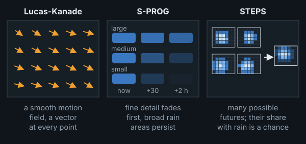

### 4.5 Moving the rain forward

All the methods move the rain the same way: each forecast cell looks back along the motion, upstream, and copies what the latest scan shows there. The rain keeps its strength; no method here makes rain grow, decay, appear or vanish, and S-PROG and STEPS only smooth small showers away over time. Appendix B.5 shows the procedure, and how differing block vectors can drop rain or copy it twice.

## 5. Results

All the methods use the same issue times, scans, 3.2 km cells and scoring, each at the amount of history that scored best (Appendix B.1). These settings were chosen on the same data they are scored on; chosen on held-out months instead, they change almost nothing (section 6). Finer cells or other block sizes from 26 to about 100 km change the scores below by less than 1% (Appendices B.2 and B.3).

### 5.1 What it looks like: three real cases

Three real cases, one per season, show what the methods do to rain. Each is the hour with the most rain moving fastest on the radar, picked by that rule alone, not by how any method did. Each animation runs through the next two hours in 10-minute steps: top left is the radar, what really happened; the other panels are the forecasts of block matching (latest pair only), the whole-map vector and pysteps Lucas-Kanade. The white outline marks where it *actually* rained 0.5 mm/h or more at that moment: forecast rain inside it is in the right place.

**Spring, 2026-05-03 21:00 UTC.** The rain moved 48 km/h toward the north-east. All three methods move it at nearly the right speed and direction (off by 6, 2 and 6 km/h) and stay close to the outline through the first hour, scoring far above persistence (FSS about 0.84 at +60 minutes, against 0.64). By the second hour the forecasts hold more rain than the radar shows: this rain was dying, which no method here can represent.

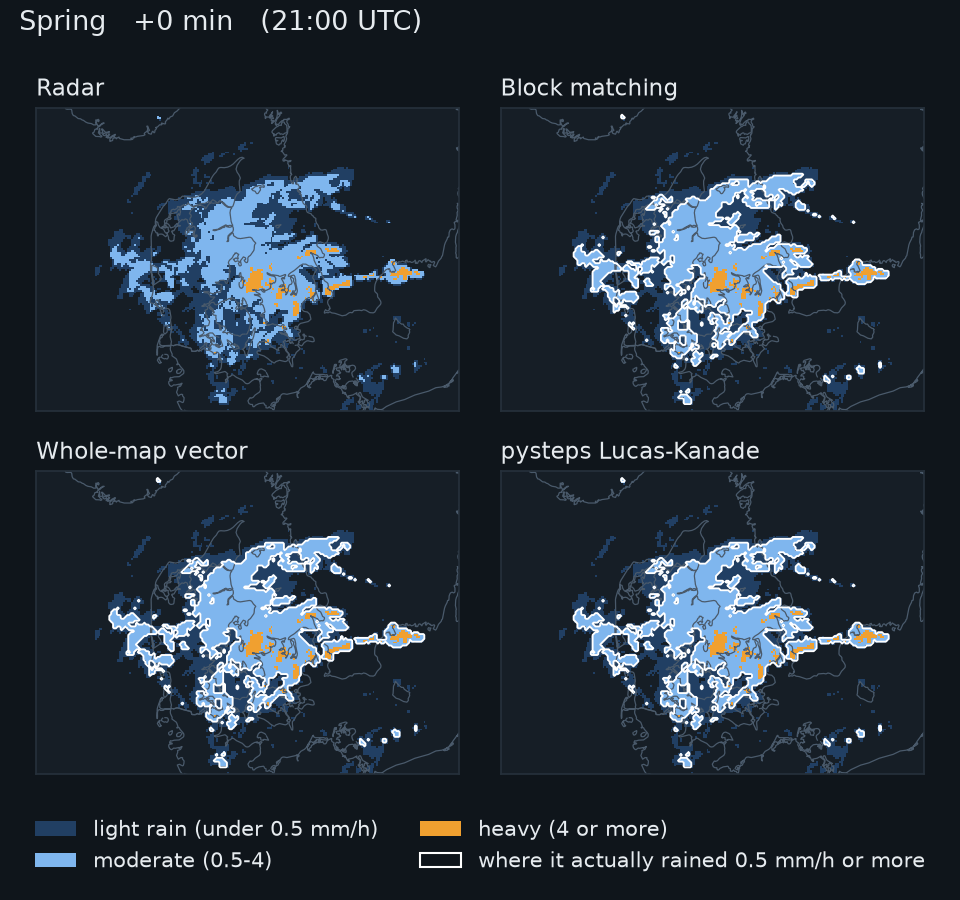

**Early summer, 2026-07-06 16:00 UTC.** The rain moved 65 km/h toward the east. The whole-map vector is closest (11 km/h off), pysteps 16 and block matching 21 km/h. Block matching's rain breaks up where neighbouring blocks disagree and thins out (its rain total is 0.73 of the observed at +60 minutes), although its FSS (0.83) stays close to the others'.

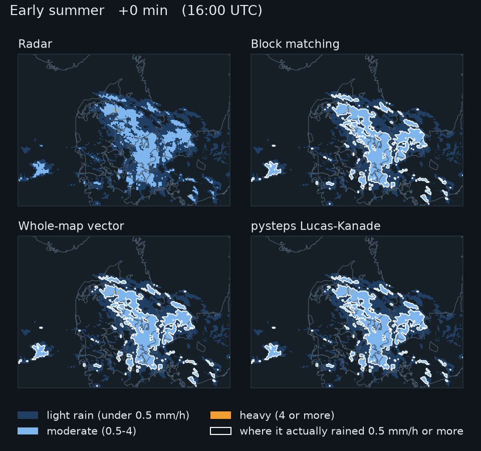

**Late summer, 2026-09-09 00:00 UTC.** The rain moved 70 km/h toward the north-east. All three methods keep pace with it (off by 4, 6 and 6 km/h), and pysteps places it best (FSS 0.91 at +60 minutes, against 0.87 for block matching and 0.88 for the whole-map vector). In the second hour the rain faded fast: at +120 minutes every forecast holds three to five times the rain the radar shows, and even persistence 3.59 times. Moving the rain correctly does not help when the rain itself is going away.

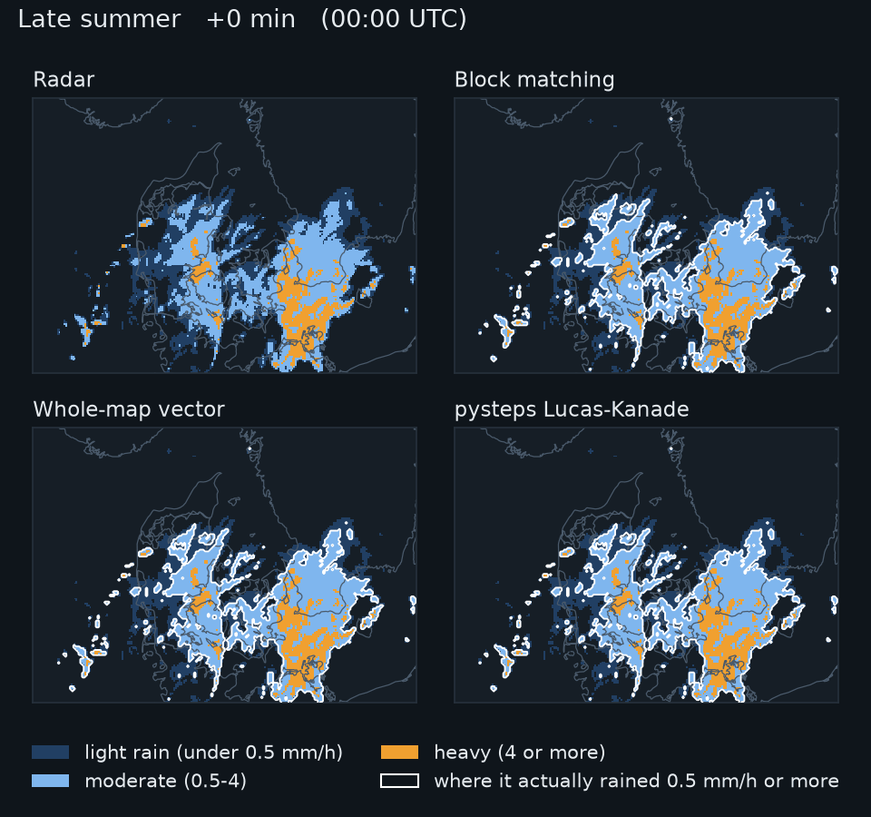

### 5.2 Does moving the rain help, and how close are simple methods?

One hour ahead, over all 157 rain episodes:

| Model type | Method | Rain placed better than "nothing moves" [95% interval] | Rain ratio |
|---|---|---|---|
| Reference | Persistence (nothing moves) | (reference) | 1.00 |
| Simple motion | Block matching | +36% [31% to 42%] | 1.08 |
|  | Whole-map vector | +35% [30% to 41%] | 1.04 |
| State of the art | pysteps Lucas-Kanade | +39% [34% to 46%] | 1.04 |
|  | pysteps S-PROG | +37% [32% to 44%] | 0.98 |
|  | pysteps STEPS, ensemble mean | +38% [32% to 44%] | 0.94 |

- **Moving the rain pays off** for every method, by 35% to 39% one hour ahead.
- **pysteps Lucas-Kanade leads up to two hours,** by 2% over block matching and 3% over the whole-map vector one hour ahead, both statistically significant. By three hours ahead the difference is gone. Its lead does not come from measuring motion more finely than a cell (Appendix B.4); its dense, smoothly varying motion field is the likely reason.
- **S-PROG and the STEPS ensemble mean** place rain a little less well than plain Lucas-Kanade: they deliberately blur small detail as the forecast ages.
- **Beyond three hours little skill is left,** for any method (Appendix B.1).

The scores at every lead time, and the methods compared pair by pair, are in Appendix D.5.

### 5.3 Block matching or one vector for the whole map?

The two simple methods are close at every lead time. Block matching is slightly ahead from one hour on, by 1% at +60 minutes, but it also forecasts more rain (1.08 of the observed one hour ahead, against 1.04): where neighbouring block vectors disagree, rain is dropped or copied twice, and the copies win (Appendix B.5). That one vector does nearly as well follows from the rain moving nearly the same way within about 50 km (section 4).

Two design details mattered about as much as the choice between the two methods: averaging each block's motion over the last hour instead of the latest pair of scans gains block matching 1% (Appendix B.1), and building the whole-map vector from the blocks' own matches, before the borrowing and filling, gains it 1% (Appendix B.4).

### 5.4 Is the amount of rain right?

Forecast rain divided by observed rain, one value per rain episode. Each box holds the middle half of the episodes, the white line is the median, and the whiskers reach from the 10th to the 90th percentile.

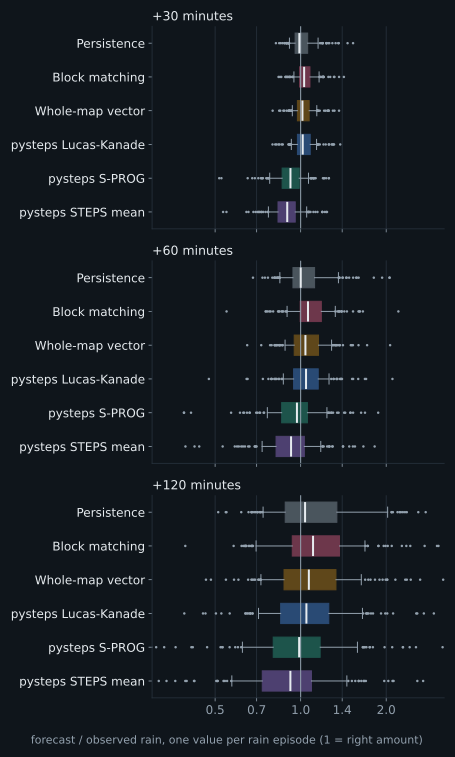

- **Most methods forecast slightly too much rain** (1.04 to 1.08 of the observed at +60 minutes), and more so further ahead: moving the rain along keeps dying rain at full strength.
- **The STEPS ensemble mean forecasts too little** (0.94 at +60 minutes, 0.84 at +3 hours): averaging members that disagree about where the rain is spreads it into weak drizzle that no longer counts as rain.

### 5.5 The chance of rain

A forecast that only says "rain" or "no rain" in each cell can be turned into a chance. Here this is done with a simple probability model: the forecast is copied 40 times, each copy shifted by a random offset that grows by about one kilometre for every three minutes ahead and keeps its direction, so that each copy is one consistent alternative future; the chance of rain is the share of copies with rain (Appendix C). The STEPS ensemble gives chances directly. Scored in every cell and at every 10-minute step, as for a person at one place, and with STEPS calibrated on the other half of the season:

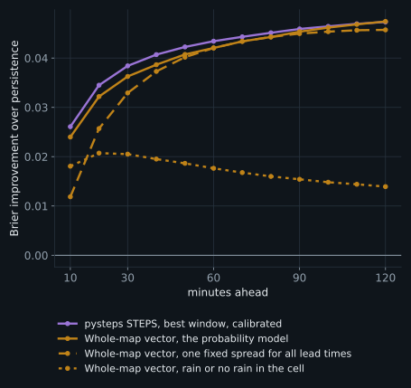

- **One forecast comes close to STEPS.** The model's improvement over "nothing moves" is 0.042 at +60 minutes against 0.043 for STEPS, and level at +2 hours (0.047 against 0.047). Read as plain rain or no rain, the same forecast reaches only 0.018.
- **The same holds for timing.** For statements like "rain starts here within an hour", the model reaches 96% of STEPS' improvement, and 99% within two hours; plain rain or no rain reaches about half.
- **STEPS' chances are a little more honest at the top:** when STEPS says 85%, it rains about 79% of the time; for chances read from single forecasts, about 74% to 76%.

### 5.6 Rain at Danish cities

The scores so far are for the whole map. A reader more often wants to know: *will it rain here in the next hour?* Each forecast was read out at five cities (Copenhagen, Aarhus, Odense, Aalborg and Esbjerg), averaged over about 10 x 10 km around the centre and added up over the next hour, and compared with the radar's own amount: 8,240 city-hours per method, of which 905 had at least 0.5 mm of rain.

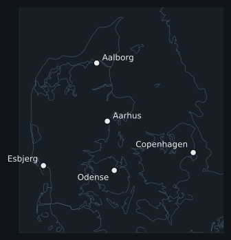

*Rainy hours caught* is the share of the rainy hours that the forecast also called rainy; *false alarms* the share of forecast rainy hours that stayed drier; the *CSI* (critical success index) combines the two, 1 being perfect.

| Model type | Method | Rainy hours caught | False alarms | CSI [95% CI] | Typical error (mm) | Rain total ratio |
|---|---|---|---|---|---|---|
| Reference | Persistence (nothing moves) | 50% | 42% | 0.37 [0.33, 0.41] | 0.24 | 1.02 |
| Simple motion | Block matching | 68% | 24% | 0.56 [0.52, 0.60] | 0.14 | 0.90 |
|  | Whole-map vector | 66% | 23% | 0.55 [0.51, 0.59] | 0.13 | 0.86 |
| State of the art | pysteps Lucas-Kanade | 69% | 21% | 0.58 [0.54, 0.62] | 0.13 | 0.88 |

- **Moving the rain clearly helps at a single place.** The three motion methods catch 66% to 69% of rainy hours, against 50% for "nothing moves", with fewer false alarms (21% to 24% against 42%).
- **The three motion methods are close:** pysteps has the best CSI, but within the intervals of the other two, and the order changes from city to city. The second hour is much harder: about half of the rainy hours are caught (Appendix D.5).
- **The motion methods seem to forecast too little rain** (rain total ratio 0.86 to 0.90, against 1.02 for persistence). This is almost entirely Copenhagen, where the radar shows a fixed echo, rain that stays put, which persistence keeps and the moving methods carry away (Appendix A.3).

## 6. Robustness checks

- **Season.** Every method gains in every month, least in April and May, when "nothing moves" already scores high; pysteps leads in every month (Appendix D.2).
- **Radar flaws.** Leaving out the cells with fixed echoes changes every map-wide score by less than 0.005 and leaves the order of the methods unchanged (Appendix A.3).
- **Related rain episodes.** Resampling whole days or rainy spells instead of episodes widens the intervals by a median of 11% and changes no conclusion (Appendix D.3).
- **Settings chosen on the same data.** Chosen on April to June and scored on July to September, and the other way round, the settings hardly change, and pysteps stays significantly ahead of both simple methods on either half (Appendix D.4).

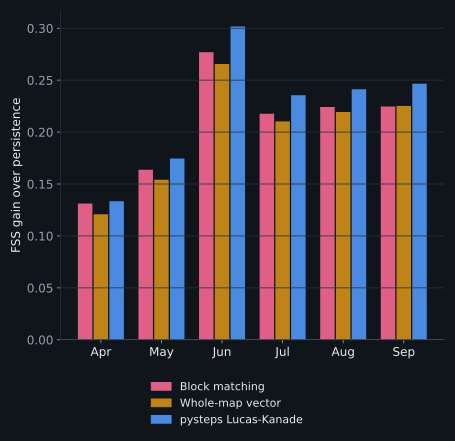

## 7. Conclusions

### 7.1 What was learned

- **Moving the rain is clearly worth it for the first two hours.** One hour ahead, every motion method places rain 35% to 39% more accurately than "nothing moves", and at a single place it catches 66% to 69% of the rainy hours instead of 50%.
- **The state of the art leads, but by little and not for long:** 2% one hour ahead, nothing significant three hours ahead. Its smooth, dense motion field is the likely reason.
- **Over Denmark, one motion for the whole map is nearly enough,** because the wind that carries the rain is nearly the same within about 50 km. For a simple method, the details of how the motion is measured matter about as much as the choice of method.
- **The limit is rain that forms or dies, not motion.** Accuracy roughly halves within three hours for every method, and moving rain keeps dying rain at full strength.
- **One forecast can give an honest chance of rain.** Read with an uncertainty that grows by about a kilometre every three minutes, it comes within a few percent of the STEPS ensemble, also for when rain starts or stops at one spot.

**In practice:** for a nowcast at one place in Denmark over the next hour or two, a simple motion model with 30 to 60 minutes of history, plus a growing uncertainty, delivers most of what the state of the art does, with far simpler code. pysteps is worth its extra machinery for the best placement in the first two hours.

### 7.2 What cannot be concluded

- **Denmark only.** The numbers, and the sizes that worked best, depend on Denmark: flat land, sea on almost every side, and a mostly westerly flow. In mountains the terrain can hold rain in place: over Switzerland, tracked radar patterns moved more slowly than the rain's motion measured by Doppler radar, possibly because rain keeps forming on windward slopes, and possibly because ground echoes and the mountains' shadow on the radar beam disturb the tracking ([Li, Schmid and Joss, 1995](https://doi.org/10.1175/1520-0450%281995%29034%3C1286:NOMAGO%3E2.0.CO;2)). There, a single motion vector could do much worse than here.
- **One season.** The archive is April to September; nothing here speaks for winter, snow or autumn storms. DMI's open API keeps only about the last 180 days.
- **No weather types.** Rain was not classified by weather type; rapidly changing flow was tested only for the amount of history (Appendix B.1).
- **One rain threshold,** 0.5 mm/h. Heavier rain (5 mm/h and above) is too rare here to score. FSS at a fixed threshold also slightly rewards forecasting too much rain; read it together with the rain ratio.
- **pysteps at its defaults, not tuned.** Tuned, pysteps might do better; so might the simple methods.
- **The radar is not perfect truth:** one conversion from radar echo to rain, no gauge calibration, some fixed echoes, and regional errors of up to a factor of two against rain gauges (Appendix A.4).
- **Not tested:** numerical weather prediction (DMI's HARMONIE model gives hourly steps a few times a day, too coarse for nowcasting, and its open API rarely answered) and deep-learning nowcasters, which have no pretrained weights for Danish radar and need far more than six months of data to train.

## 8. Open questions

- **Growth and decay.** The main limit after the first hour: none of the methods can predict a shower forming, growing or dying.
- **What sets pysteps apart?** Its dense, smoothly varying motion field is the main candidate; blending block vectors between block centres (Appendix B.3) tests only part of that.
- **A 2 km grid.** It helps pysteps and block matching when rain placement is judged over about 10 km, at about five times the cost (Appendix B.2).
- **Fronts, lows and weather types.** Where the flow turns quickly a long history lags a little (Appendix B.1); whether smaller blocks help there is open. Classifying rain by weather type would also explain the spring behaviour (section 6).
- **Scoring at single places** against DMI's rain gauges instead of the radar, which is closer to what one person experiences.
- **Winter and heavy rain.** The archive grows every night: winter from about March 2027, and with it enough heavy rain to score on its own.

## Appendix A. The radar data

**Details of the data.**

- **Source.** The composite radar product from the DMI Open Data API (`opendataapi.dmi.dk`, no key required; see DMI's terms of use for reuse): ODIM HDF5 files on a 500 m grid.
- **The radars.** Five C-band weather radars (Rømø, Sindal, Samsø, Stevns and Bornholm) with a 1° beam and 500 m range resolution, each scanning from 0.5° to 15° elevation out to 240 km. The composite combines them into one picture; where radars overlap, the highest value is kept ([DMI radar documentation](https://www.dmi.dk/friedata/dokumentation/radar-data); beam and range figures from [Schleiss et al., 2020, *Hydrology and Earth System Sciences* 24, 3157-3188](https://doi.org/10.5194/hess-24-3157-2020)).
- **Period.** 2026-04-01 to 2026-09-23, 176 days, 50,688 scans of both types (A.1); 25,300 full-range scans are used.
- **Conversion.** Radar reflectivity is converted to rain rate in mm/h with the Marshall-Palmer relation stored in each file (Z = 200 R^1.6), values under 0.05 mm/h are set to zero, and the scan is averaged onto a 224 x 160 grid (cells of about 3.2 km on each side near 56 N) covering 5.0 to 16.5 E and 53.9 to 58.5 N. Pixels flagged as *no data* stay missing; a grid cell is missing if less than half of it has data.
- **Scoring area.** Denmark and its waters (8.0 to 15.3 E, 54.3 to 58.0 N), and only the cells the radar actually covered (96% of that box).

### A.1 Full-range and doppler scans

DMI's composite alternates two products, which the API labels with `scanType`:

- **full range**, at minutes divisible by 10 (:00, :10, ...): 25,300 scans in the archive. Each radar sees out to 240 km; no data over 46% of the raster, the far corners beyond that range.
- **doppler**, in between (:05, :15, ...): 25,319 scans. Scans made for measuring wind (radial velocity), reaching only 120 km; no data over 79% of the raster.

The label matches the minute for every one of the 50,619 scans the API listed for the period. Beyond the doppler scans' reach, only the full-range scans see anything:

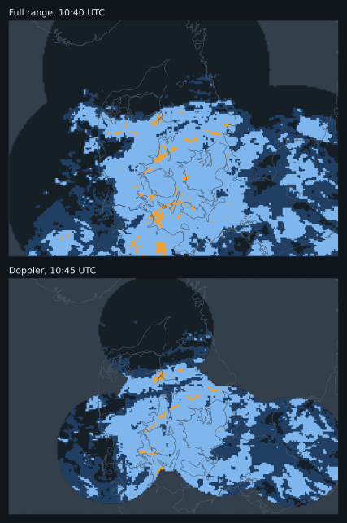

Reading the doppler scans' missing area as "no rain" makes every other frame lose the rain far from the radars. A motion estimate between a full and a doppler scan then mostly measures that change in coverage. **This benchmark uses the full-range scans only**, which gives one scan every 10 minutes. A.2 tests whether the 5-minute spacing would help if the coverage problem is set aside.

### A.2 Scans 5 or 10 minutes apart?

Using only the full-range scans also doubles the gap between the scans a method compares, which could help or hurt on its own. To separate the two, both kinds of scan were restricted to the area *both* cover (37% of the grid, 56% of the scoring box), set to "no radar" everywhere else in every frame, and the methods were run on all scans (5 minutes apart) and on the full-range scans only (10 minutes apart), at the same 1,648 issue times. Rain moving out of this smaller area is lost and none comes in, so the rain ratios are below 1 and the gains are lower than elsewhere in this report: compare the two scan spacings with each other, not these numbers with the rest of the report.

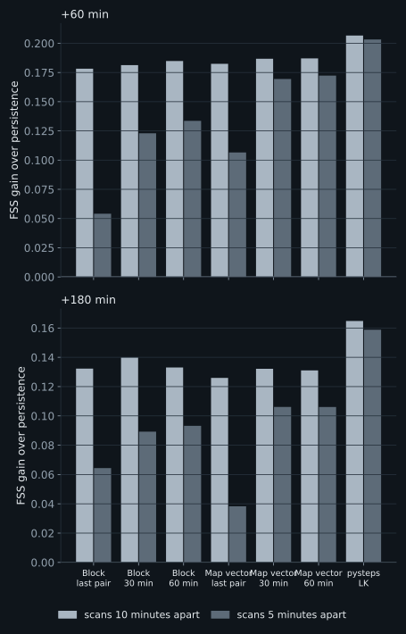

- **The simple methods are much worse with scans 5 minutes apart** when they use only the latest pair. Block matching falls from +0.178 to +0.054 and over-forecasts rain (1.35 of the observed total); a whole-map vector from one pair falls from +0.182 to +0.107. Averaging an hour of 5-minute pairs recovers most of the loss, for block matching (+0.134, rain ratio 1.12) and for the whole-map vector (+0.172), but not all.
- **pysteps is almost unaffected** (+0.207 against +0.203).
- **Why.** Rain moves about one grid cell in 5 minutes, so a whole-cell match between two scans that close rounds a large share of the motion away. But rounding is not the main cause: refining each block's match to a fraction of a cell (Appendix B.4) recovers only +0.011 [+0.006, +0.017] for block matching, while averaging each block over an hour of pairs recovers +0.079 [+0.070, +0.091]. Single matches between scans 5 minutes apart are noisy, because the rain moves little compared with how much it changes shape, and neighbouring blocks that disagree copy rain twice.

So for block matching the gap between the matched scans matters, and so does averaging several pairs when the gap is short. With 10-minute scans, more history gains only a little (Appendix B.1).

### A.3 Fixed echoes

Some places show rain on the radar far more often than rain allows: *fixed echoes*, from tall structures or wind turbines, or from the beam catching the ground. They were found by how often each cell is wet (0.5 mm/h or more) in the scans in which almost the whole map is dry. Over the scoring area the median is 0.01% of such scans, and 99% of cells stay below 0.13%. One cell at Copenhagen is wet in 2.9% of them, and over the whole archive the Copenhagen area averages 0.17 mm/h against 0.08 mm/h around it. Offshore wind farms in the southern Baltic show the same signature. The source of the Copenhagen echo was not identified.

A fixed echo stays put: persistence keeps it, and a method that moves the rain carries it away, so near an echo the moving methods seem to forecast too little rain (section 5.6).

**Masking them.** Cells wet in more than 1% of the almost-dry scans, and the ring of cells around each, were treated as having no radar data, in the inputs and in the scoring: 100 cells, 0.54% of the scoring area. Every map-wide score (section 5.2) changes by less than 0.005, and the order of the methods does not change.

**At Copenhagen.** The usual 3 x 3 city area lies entirely inside the mask, so the check uses 5 x 5 cells (about 16 km) with and without it. The rain ratio of block matching goes from 0.86 to 1.01, but that of the whole-map vector only from 0.75 to 0.82, and of pysteps Lucas-Kanade from 0.74 to 0.81. The cells left around the core still carry a weaker echo, wet in 0.16% of the almost-dry scans (median). A threshold low enough to catch it (0.5%) masks 23 of the 25 cells, so Copenhagen cannot be verified cleanly from this radar product. The rest of the report uses the unmasked data.

### A.4 Radar against rain gauges

DMI's weather stations also measure rain, in mm per hour. For every gauge and hour of the archive, the gauge's rain was set against the radar's in the gauge's 3.2 km grid cell, averaged over the six full-range scans of that hour (`scripts/fetch_gauges.py`, `scripts/radar_vs_gauges.py`). Two of the 42 gauges were left out as faulty, by a check that does not use the radar: their season total was less than half that of their three nearest neighbours. That leaves 162,650 gauge-hours. A rainy hour is one with at least 0.5 mm.

| Gauges | Number | Radar over gauge, season | Hour-by-hour correlation | Rainy hours caught | False alarms |
|---|---|---|---|---|---|
| All gauges | 40 | 1.13 | 0.62 | 62% | 38% |
| Nearest radar: Sindal | 6 | 0.58 | 0.59 | 39% | 32% |
| Nearest radar: Bornholm | 2 | 1.02 | 0.72 | 65% | 35% |
| Nearest radar: Rømø | 8 | 1.03 | 0.73 | 66% | 30% |
| Nearest radar: Samsø | 14 | 1.29 | 0.56 | 67% | 41% |
| Nearest radar: Stevns | 10 | 1.45 | 0.66 | 67% | 45% |

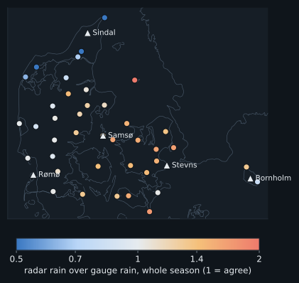

- **Over the season the radar reads 1.13 times the gauge rain.** Part of that is the gauges: in wind they typically catch 2 to 10% too little rain (Sevruk, 1982; for Danish gauges, Allerup, Madsen and Vejen, 1997).
- **The radars disagree with each other.** Near Rømø and Bornholm radar and gauges agree; around Sindal, in the north, the radar sees little more than half the gauge rain, and around Stevns, on Zealand, about half as much again. Calibration differences between the radars are the likely cause, possibly helped by the composite keeping the highest value where radars overlap; neither was tested.
- **Hour by hour the agreement is moderate** (correlation 0.62): a gauge catches rain on a few hundred square centimetres, the radar averages over about 10 square kilometres, and a shower can fall on one and not the other.
- **The gauges cannot confirm the fixed echo at Copenhagen:** no gauge sits in it. The nearest, at Kastrup airport about 6 km away, reads like its neighbours.

For this benchmark the errors are the same for every method, so the comparisons of section 5 stand. They do mean that the 0.5 mm/h threshold catches less real rain in the north than on Zealand.

## Appendix B. Method studies

Four parts of the simple methods are tested here: how much history they use (B.1), the size of the grid cells the radar is averaged onto (B.2), the size of the blocks that are matched between scans (B.3), and how the motion is measured from the matches (B.4). Outside B.1, block matching uses the latest pair of scans.

### B.1 How much history

**How several scans are used.** How far back a method looks is its *history*, counted in scans 10 minutes apart: the latest pair covers 10 minutes, 4 scans 30 minutes, 7 scans an hour. The last *n* scans form *n* − 1 pairs (scans 1 and 2, scans 2 and 3, and so on), each matched on its own. The whole-map vector is first made for each pair, across the whole map; these pair vectors are then averaged with equal weight. Block matching averages each block's vector over the pairs, weighted by how well each pair matched, and only then applies the neighbour borrowing and filling. Either way, averaging several pairs averages out their separate measurement errors:

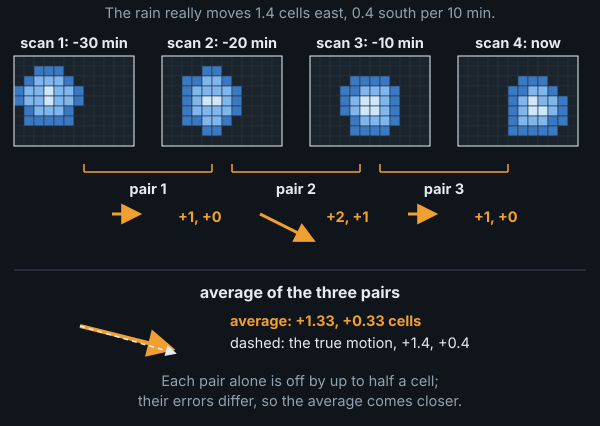

**Why more history can help.** The flow that carries rain changes slowly. Over North America, [Germann, Zawadzki and Turner (2006)](https://doi.org/10.1175/JAS3735.1) found that most of the loss of predictability of radar rain patterns comes from rain growing and decaying; changes in the motion itself played a small, though not negligible, part. The data here agree: one hour later the whole-map vector has typically changed by 4 km/h, and three hours later by 7 km/h, against a typical speed of 40 km/h, and part of that change is measurement noise (`results/motion-stats.json`). So the scan pairs of the last half hour or hour mostly measure the same motion, each with its own error, and one motion measured now can be used for hours ahead.

Both simple methods were run with every window from the latest pair up to 13 scans (two hours), the whole-map vector also with recent pairs weighted more, and pysteps Lucas-Kanade on 4, 7 and 13 scans, out to 6 hours ahead (the pairs are combined as described above). This is a separate run that needs two hours of history, so its persistence row differs slightly from section 5.2. FSS gain over persistence:

| Method | +30 min | +60 min | +120 min | +180 min | +240 min | +360 min | Rain ratio at +60 |
|---|---|---|---|---|---|---|---|
| *Persistence FSS (reference)* | 0.78 | 0.59 | 0.39 | 0.28 | 0.22 | 0.16 | 1.00 |
| Block matching, last pair (10 min) | +0.128 | +0.209 | +0.232 | +0.206 | +0.172 | +0.096 | 1.06 |
| Block matching, 4 scans (30 min) | +0.130 | +0.212 | +0.236 | +0.209 | +0.172 | +0.091 | 1.10 |
| Block matching, 7 scans (1 h) | +0.133 | +0.215 | +0.235 | +0.205 | +0.168 | +0.079 | 1.08 |
| Block matching, 13 scans (2 h) | +0.136 | +0.217 | +0.233 | +0.204 | +0.164 | +0.064 | 1.06 |
| Whole-map vector, last pair (10 min) | +0.131 | +0.206 | +0.224 | +0.201 | +0.166 | +0.079 | 1.04 |
| Whole-map vector, 3 scans (20 min) | +0.132 | +0.208 | +0.225 | +0.202 | +0.166 | +0.078 | 1.04 |
| Whole-map vector, 4 scans (30 min) | +0.133 | +0.209 | +0.225 | +0.201 | +0.164 | +0.076 | 1.04 |
| Whole-map vector, 5 scans (40 min) | +0.133 | +0.209 | +0.225 | +0.201 | +0.163 | +0.075 | 1.04 |
| Whole-map vector, 7 scans (1 h) | +0.132 | +0.208 | +0.223 | +0.198 | +0.161 | +0.074 | 1.04 |
| Whole-map vector, 10 scans (1.5 h) | +0.132 | +0.208 | +0.222 | +0.197 | +0.159 | +0.074 | 1.04 |
| Whole-map vector, 13 scans (2 h) | +0.132 | +0.207 | +0.219 | +0.194 | +0.156 | +0.074 | 1.04 |
| Whole-map vector, 13 scans, recent pairs weighted (half-life 3) | +0.132 | +0.209 | +0.223 | +0.198 | +0.161 | +0.075 | 1.04 |
| Whole-map vector, 13 scans, recent pairs weighted (half-life 6) | +0.132 | +0.208 | +0.222 | +0.196 | +0.159 | +0.074 | 1.04 |
| pysteps Lucas-Kanade, 4 scans (30 min) | +0.143 | +0.233 | +0.244 | +0.198 | +0.142 | +0.032 | 1.04 |
| pysteps Lucas-Kanade, 7 scans (1 h) | +0.143 | +0.232 | +0.243 | +0.196 | +0.140 | +0.033 | 1.04 |
| pysteps Lucas-Kanade, 13 scans (2 h) | +0.143 | +0.230 | +0.239 | +0.193 | +0.138 | +0.033 | 1.04 |

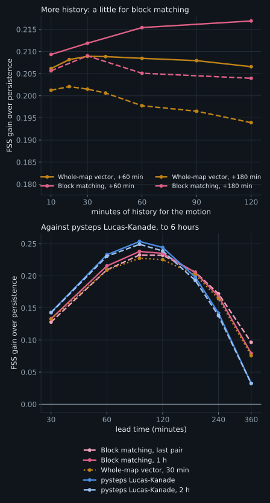

- **Block matching gains a little from more history.** An hour of scan pairs over the latest pair alone gains +0.005 [+0.003, +0.007] at +30 minutes and +0.006 [+0.003, +0.010] at +60, and nothing clear by +2 hours (+0.003 [-0.003, +0.009]). Each block's vector comes from a single 26 km patch, so it is noisy, and averaging several pairs calms it. Its excess rain hardly changes (1.08 against 1.06 at +60 minutes). Two hours adds a little more at +60 minutes (+0.001 [+0.000, +0.003]) but loses at 6 hours (-0.015 [-0.027, -0.005]).
- **For the whole-map vector, about 30 minutes is best, and the differences are small.** 30 minutes over the latest pair gains +0.003 [+0.002, +0.004] at +60 minutes: one pair is already an average over hundreds of blocks. Longer windows lose a little, more at longer leads: an hour instead of 30 minutes changes the gain by -0.004 [-0.006, -0.002] at +180 minutes, two hours instead of one by -0.004 [-0.006, -0.002].
- **Weighting recent pairs more helps only over long windows:** over two hours of history, a weighting that halves the influence of a pair every 30 minutes beats the plain average by +0.005 [+0.003, +0.006] at +180 minutes, but it does not beat a plain 30-minute average.
- **pysteps Lucas-Kanade does not depend on history** (+0.233 with 30 minutes, +0.232 with an hour).
- **With scans 5 minutes apart, history matters far more** (Appendix A.2).

**Does history lag where the flow turns?** An average over past scans should lag behind when the flow changes quickly, at a front or around a low. To test this, every issue time was rated by how much the wind about 3 km up (the 700 hPa pressure level), which is the wind that carries the rain over Denmark (Appendix B.3), changed over the next hour. The wind comes from the ERA5 reanalysis, averaged over the scoring area, so the rating does not depend on the radar. The history run was then scored again in the third of issue times where that wind changed least (median 1 km/h) and the third where it changed most (median 4 km/h), with no new forecasts (`scripts/turning_flow.py`). The figure shows, for each amount of history, how much better (above 0) or worse (below 0) it scores than the history section 5 uses (dashed line), in steady and in turning flow:

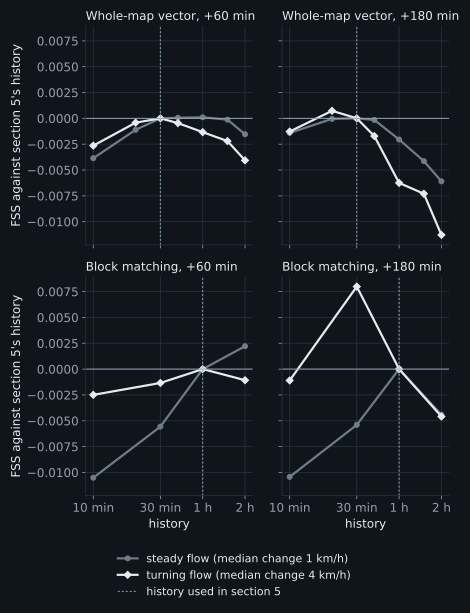

- **When the flow turns, older scans mislead.** They measured a motion that has since changed. So for the whole-map vector, two hours of history instead of 30 minutes scores 0.011 lower at +3 hours in turning flow, but only 0.006 lower in steady flow. And for block matching, an hour of history instead of the latest pair alone scores 0.011 higher at +60 minutes in steady flow, but only 0.002 higher in turning flow.
- **The best history moves a little shorter, but the effects are small.** In turning flow at +3 hours, block matching does best with 30 minutes instead of an hour (+0.008), and the whole-map vector with 20 minutes instead of 30 (+0.001); at +60 minutes the histories of section 5 stay at or close to the best, and the latest pair alone is never the best. All these differences are about 0.01 or less, smaller than the gaps between the methods, so the settings of section 5 hold.
- **Two other ways of finding turning flow mostly agree:** the change of the rain's own motion on the radar over the next hour, and how strongly that wind changes direction from place to place across the map, as it does around lows and across fronts. Both show the same pattern for the whole-map vector and Lucas-Kanade; for block matching only the curvature does.

**In short:** the best history is about an hour for block matching and about 30 minutes for the whole-map vector and pysteps Lucas-Kanade. Section 5 uses these. They were chosen on the same data they are reported on (section 5), but choices made on one half of the season hold up on the other (Appendix D.4).

### B.2 Cell size

**Set-up.** DMI's composite has 500 m pixels; the rest of this report averages them onto 3.2 km cells. For this study the archive was rebuilt from the same raw files on two finer grids, 2 km (358 x 256 cells) and 1 km (717 x 512), keeping only the full-range scans. Everything else that is counted in cells was kept fixed in kilometres, so only the resolution changes: blocks of about 26 km (8, 13 and 26 cells), a search radius of about 19 km (6, 10 and 19 cells; rain up to about 115 km/h with scans 10 minutes apart), and the FSS neighbourhoods of about 30 km (9, 15 and 29 cells) and 10 km (3, 5 and 9 cells). All three grids were scored at the same 1,649 issue times as section 5, for persistence, block matching, the whole-map vector and pysteps Lucas-Kanade, each against persistence on its own grid, so a finer grid is not credited merely for resolving the radar more finely. Rerun on the 3.2 km grid, every score is identical to section 5.

FSS gain over persistence at +60 minutes, judged over about 30 km, as in section 5:

| Method | 3.2 km | 2 km | 1 km | 2 km minus 3.2 km [95% CI] | 1 km minus 3.2 km [95% CI] | Episodes better at 1 km |
|---|---|---|---|---|---|---|
| Block matching | +0.209 | +0.209 | +0.211 | -0.001 [-0.003, +0.001] | +0.001 [-0.001, +0.004] | 60% |
| Whole-map vector (30 min) | +0.209 | +0.207 | +0.207 | -0.002 [-0.003, -0.001] | -0.002 [-0.003, -0.001] | 50% |
| pysteps Lucas-Kanade | +0.233 | +0.235 | +0.240 | +0.002 [+0.001, +0.003] | +0.007 [+0.005, +0.010] | 80% |

The same, judged over about 10 km:

| Method | 3.2 km | 2 km | 1 km | 2 km minus 3.2 km [95% CI] | 1 km minus 3.2 km [95% CI] | Episodes better at 1 km |
|---|---|---|---|---|---|---|
| Block matching | +0.216 | +0.223 | +0.224 | +0.008 [+0.005, +0.010] | +0.009 [+0.006, +0.012] | 74% |
| Whole-map vector (30 min) | +0.202 | +0.203 | +0.200 | +0.001 [-0.001, +0.002] | -0.002 [-0.003, -0.001] | 43% |
| pysteps Lucas-Kanade | +0.247 | +0.261 | +0.267 | +0.014 [+0.012, +0.018] | +0.020 [+0.016, +0.025] | 93% |

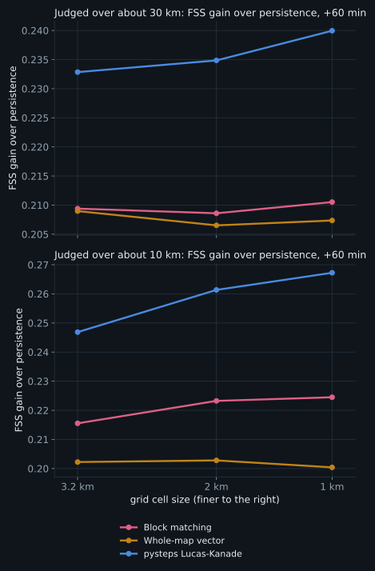

The 1 km grid minus the 3.2 km grid at other lead times, judged over about 10 km:

| Method | +30 min | +60 min | +120 min | +180 min |
|---|---|---|---|---|
| Block matching | +0.007 [+0.005, +0.010] | +0.009 [+0.006, +0.012] | +0.007 [+0.002, +0.011] | +0.008 [+0.002, +0.015] |
| Whole-map vector (30 min) | -0.004 [-0.005, -0.003] | -0.002 [-0.003, -0.001] | +0.003 [+0.001, +0.005] | +0.004 [+0.001, +0.006] |
| pysteps Lucas-Kanade | +0.015 [+0.012, +0.018] | +0.020 [+0.016, +0.025] | +0.010 [+0.005, +0.016] | +0.008 [+0.001, +0.015] |

By distance from the nearest radar (judged over about 30 km, +60 minutes):

| Method | Distance from the nearest radar | 3.2 km | 2 km | 1 km | 1 km minus 3.2 km [95% CI] |
|---|---|---|---|---|---|
| Block matching | under 60 km | +0.209 | +0.205 | +0.207 | -0.002 [-0.007, +0.002] |
| Block matching | 60-120 km | +0.208 | +0.209 | +0.211 | +0.003 [-0.000, +0.006] |
| Block matching | over 120 km | +0.216 | +0.214 | +0.219 | +0.003 [-0.004, +0.010] |
| Whole-map vector (30 min) | under 60 km | +0.209 | +0.207 | +0.208 | -0.001 [-0.003, -0.000] |
| Whole-map vector (30 min) | 60-120 km | +0.208 | +0.206 | +0.206 | -0.002 [-0.003, -0.001] |
| Whole-map vector (30 min) | over 120 km | +0.213 | +0.212 | +0.213 | -0.000 [-0.002, +0.001] |
| pysteps Lucas-Kanade | under 60 km | +0.231 | +0.233 | +0.237 | +0.005 [+0.003, +0.008] |
| pysteps Lucas-Kanade | 60-120 km | +0.233 | +0.234 | +0.238 | +0.006 [+0.003, +0.009] |
| pysteps Lucas-Kanade | over 120 km | +0.240 | +0.244 | +0.254 | +0.014 [+0.011, +0.018] |

Rain at the five cities of section 5.5, CSI for the next hour (the city area is about 10 x 10 km on every grid):

| Method | 3.2 km | 2 km | 1 km |
|---|---|---|---|
| Persistence (nothing moves) | 0.37 | 0.37 | 0.37 |
| Block matching | 0.55 | 0.54 | 0.56 |
| Whole-map vector | 0.55 | 0.56 | 0.57 |
| pysteps Lucas-Kanade | 0.58 | 0.59 | 0.62 |

- **Over 30 km, cell size hardly matters.** The changes are below 0.01 for every method, which is why the choice of grid does not affect the conclusions of section 5.
- **Judged over 10 km, a finer grid helps the methods that track local detail.** At +60 minutes, 1 km improves pysteps Lucas-Kanade by +0.020 [+0.016, +0.025] (better in 93% of rain episodes) and block matching by +0.009 [+0.006, +0.012]. Most of it comes with the first step: 2 km already gives pysteps +0.014 [+0.012, +0.018].
- **The whole-map vector gains nothing, and even loses a little** (-0.002 [-0.003, -0.001]): a single vector has no local detail to benefit from finer cells.
- **At the cities the gain goes to pysteps.** Its CSI for rain in the next hour rises from 0.58 on the 3.2 km grid to 0.62 on 1 km; block matching (0.55 to 0.56) and the whole-map vector (0.55 to 0.57) change little.
- **The gain is not where the radar beam predicts.** The beam is narrow near the radars (section 2), so finer cells were expected to add most there. Instead pysteps gains most far from them (+0.014 [+0.011, +0.018] beyond 120 km, against +0.005 [+0.003, +0.008] within 60 km). The far band is different ground. It is mostly land (22% sea, against 62% near the radars), at the edges of the scoring area in Sweden and Germany. The radar sees rain there less often (wet in 0.017 of scans against 0.025), and the detected rain is patchier (10.1 trackable features per 1,000 cells against 14.9), as expected where the beam passes over shallow rain. A plausible explanation, not tested, is that with sparse, patchy rain small placement errors weigh more, so the finer placement a 1 km grid gives pysteps pays off most there.
- **Cost.** On a 14-core machine the benchmark took about 3 minutes on the 3.2 km grid, 15 minutes on 2 km and 3 hours 40 minutes on 1 km, where each block-matching step searches ten times as many cells over a ten times larger window. The archive of full-range scans is about 9 GB at 2 km and 35 GB at 1 km.

**In short:** for forecasts judged at the scale of a town, a 2 km grid is worth having for pysteps and block matching; 1 km adds a little more at a large cost; for the headline comparisons of this report the grid does not matter.

### B.3 Block size

Block matching measures one vector per 8 x 8-cell block (about 26 km). A block should be about as large as the area over which the rain moves the same way: smaller, and each vector is noisier and neighbours disagree; larger, and real differences in motion are averaged away. Denmark favours large areas: its highest point is 170.86 m (Møllehøj, measured by the Danish Geodata Agency in 2005, as reported by [Wikipedia](https://en.wikipedia.org/wiki/M%C3%B8lleh%C3%B8j)), and no place in the country is more than about 52 km from the sea ([VisitDenmark](https://www.visitdenmark.com/faq/geography)). With no mountains to block, lift or channel the flow, the wind that carries rain should change only gradually across the country. This study measures that area first, then tests block sizes against it.

**How far does the rain move the same way?** At every issue time, individual rain features were tracked over the last 30 minutes with pysteps' Lucas-Kanade method, using its raw tracks before any interpolation, about 250 per issue time inside the scoring area. For every pair of tracks, the difference in their motion was recorded against the distance between them. (Small matched blocks cannot be used for this: at this resolution their whole-cell matches scatter by tens of km/h.) Tracks a few kilometres apart differ by about 6 km/h, which is measurement noise; the difference grows to 8 km/h at 45 km, 11 km/h at 85 km, 17 km/h at 145 km and 22 km/h at 245 km, against a typical speed of 40 km/h. There is no distance at which the motion suddenly stops agreeing: it changes gradually across the map. Within about 50 km it is uniform to within the noise; across the country it differs by more than half the typical speed. The three seasons of the archive give nearly the same curve.

**Do ground stations show the same?** DMI's open observation data give 10-minute mean winds at 68 Danish stations. At the issue times their wind has a median speed of only 17 km/h, 37% of the rain's own speed measured within 25 km of each station, and its direction is turned anticlockwise from the rain's by a median of 30 degrees (half of the cases between 5 to 61 degrees; only 40% within 30 degrees), over 30,835 station-hours. This is the effect of friction near the ground, which slows the wind and turns it with height ([Lindvall and Svensson, 2019](https://doi.org/10.1002/qj.3605)). The station winds also disagree strongly over short distances: stations about 10 km apart already differ by 12 km/h, near their typical speed, because local surroundings dominate the wind at the ground. So ground stations cannot measure the scale that matters for moving rain.

**And the wind at cloud height?** Rain is carried by the wind at the height of the clouds that produce it. For convective storms the drift of existing cells is usually taken to be the mean wind of the *cloud layer*, between the 850 and 300 hPa pressure levels, roughly 1.5 to 9 km up ([Corfidi, 2003](https://doi.org/10.1175/1520-0434%282003%29018%3C0997:CPAMPF%3E2.0.CO;2)). The rain pattern as a whole can still move somewhat differently, because storms also *propagate*: new cells form on one side as old ones decay on the other ([Corfidi, 2003](https://doi.org/10.1175/1520-0434%282003%29018%3C0997:CPAMPF%3E2.0.CO;2)). The ERA5 reanalysis (Copernicus Climate Data Store; hourly, on a 0.25° grid) gives the wind at 850, 700, 500 and 300 hPa, from about 1.5 to 9 km up. Interpolated to each tracked rain feature's place and time (`scripts/era5_vs_rain.py`), it agrees with the rain's motion far better than the ground stations do, and best at 700 hPa, about 3 km up:

| Wind | Speed over the rain's | Turn from the rain's direction | Within 30° | Typical difference |
|---|---|---|---|---|
| 850 hPa (about 1.5 km) | 0.89 | +3° | 82% | 15 km/h |
| 700 hPa (about 3 km) | 1.00 | +2° | 95% | 9 km/h |
| 500 hPa (about 5.5 km) | 1.20 | 0° | 92% | 14 km/h |
| 300 hPa (about 9 km) | 1.77 | -1° | 79% | 43 km/h |
| Mean of the four | 1.17 | +1° | 93% | 13 km/h |

At 700 hPa the wind moves at 1.00 of the rain's speed, in the same direction to within a few degrees. It also changes with distance much as the rain's motion does (figure below): two places about 50 km apart differ by about 7 km/h, and about 250 km apart by 23 km/h, against 8 and 22 km/h for the rain tracks. So the wind aloft confirms, independently of the radar, that the motion is nearly uniform over about 50 km. ERA5 is smoother than the real wind and cannot show differences over less than about 30 km. It is also built after the fact, so it shows what carries the rain, not a forecast a nowcast could use in real time.

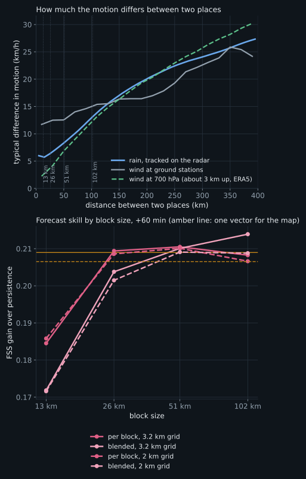

**Which block size forecasts best?** Block matching was run with blocks of about 13, 26, 51 and 102 km, each as a plain per-block field and as a field blended smoothly between block centres, at the same issue times as section 5. On the 3.2 km grid (FSS gain over persistence, about 30 km, +60 minutes; differences paired against the 26 km blocks used in the rest of the report):

| Block size | Per block, +60 min | Per block minus 26 km [95% CI] | Blended, +60 min | Blended minus 26 km per block [95% CI] | Rain ratio at +180, per block |
|---|---|---|---|---|---|
| 13 km (4 cells) | +0.185 | -0.025 [-0.030, -0.020] | +0.172 | -0.038 [-0.043, -0.032] | 1.00 |
| 26 km (8 cells) | +0.209 | (reference) | +0.204 | -0.006 [-0.007, -0.004] | 1.13 |
| 51 km (16 cells) | +0.211 | +0.001 [-0.002, +0.005] | +0.210 | +0.001 [-0.003, +0.005] | 1.11 |
| 102 km (32 cells) | +0.208 | -0.001 [-0.006, +0.003] | +0.214 | +0.005 [-0.001, +0.010] | 1.07 |
| whole map (one vector, 30 min) | +0.209 | -0.000 [-0.005, +0.004] | | | |

- **13 km blocks are clearly worse** (-0.025 [-0.030, -0.020]): they hold too little rain pattern for a reliable match (the 2 km results below show that it is the small area, not the few cells).
- **From 26 to 102 km, and up to one vector for the whole map, the differences are small** (within about 0.01). Larger blocks forecast less excess rain at long lead times.
- **Blending between block centres hurts small blocks**, where it spreads the noise of each vector across its neighbours, and makes no clear difference for large ones (+0.005 [-0.001, +0.010] at 102 km).

This matches the tracked motion: the rain moves nearly uniformly within about 50 km, so blocks of 26 to 100 km all capture it, and smaller blocks only add noise.

**On the 2 km grid**, where a 13 km block has 6 cells instead of 4, the picture is the same:

| Block size | Per block, +60 min | Per block minus 26 km [95% CI] | Blended, +60 min | Blended minus 26 km per block [95% CI] | Rain ratio at +180, per block |
|---|---|---|---|---|---|
| 13 km (6 cells) | +0.186 | -0.023 [-0.027, -0.018] | +0.172 | -0.037 [-0.042, -0.032] | 0.98 |
| 26 km (13 cells) | +0.209 | (reference) | +0.201 | -0.007 [-0.008, -0.006] | 1.12 |
| 51 km (25 cells) | +0.210 | +0.002 [-0.001, +0.005] | +0.209 | +0.000 [-0.003, +0.004] | 1.12 |
| 102 km (51 cells) | +0.207 | -0.002 [-0.006, +0.003] | +0.209 | +0.000 [-0.005, +0.005] | 1.07 |
| whole map (one vector, 30 min) | +0.207 | -0.002 [-0.006, +0.002] | | | |

The 13 km blocks are still clearly worse (-0.023 [-0.027, -0.018]), so the problem is the small area rather than the few cells: a 13 km patch of rain holds too little structure, and changes too much between two scans, to be matched reliably. From 26 to 102 km the results are again level.

**In short:** the 26 km blocks sit at the start of a broad optimum that reaches to about 100 km, consistent with the rain moving nearly uniformly over about 50 km. Changing the block size within that range makes no clear difference; larger blocks, with blending, would slightly reduce the excess rain at long lead times. Blocks smaller than about 26 km should be avoided. Chosen on one half of the season, the block size does not carry over exactly to the other (Appendix D.4), another sign that it matters little.

### B.4 Measuring motion: speed and sub-cell matching

**How fast, and which way?** In this archive (`results/motion-stats.json`) the whole-map vector has a median speed of 40 km/h (half of the cases from 30 to 51 km/h). At 74% of the issue times the rain moved toward the east or north-east, against 3% toward any westerly direction: rain over Denmark mostly arrives from the west and south-west. Individual rain features tracked with pysteps' Lucas-Kanade method, which has no search limit, move slower than 96 km/h in 99% of cases, and only 0.1% faster than the 115 km/h block matching can follow (section 4.2).

**Is the whole-map vector's speed right?** It runs a little slower than the rain features pysteps' Lucas-Kanade method tracks (B.3): a median 0.91 of their speed (40 against 43 km/h). The method itself is not biased: on a scan moved by a known amount it measures a median 1.01 of that amount. And speeding the vector up hardly helps: by 5% it gains +0.002 [+0.001, +0.003] at +60 minutes, by 10% +0.002 [-0.000, +0.004], by 15% +0.000 [-0.003, +0.003]. A possible reason for the gap, not tested here, is that the trackable parts of the rain, its sharp edges and cores, move a little faster than the rain as a whole.

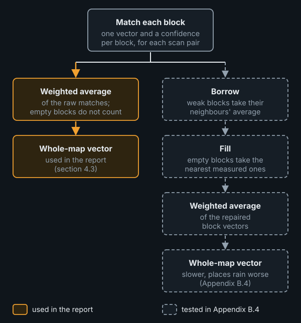

**Which block vectors to average?** The whole-map vector is the confidence-weighted average of each block's own match (section 4.3). Block matching, before it moves the rain, repairs those matches (section 4.2): weakly matched blocks borrow the average of their confident neighbours, and empty blocks are filled from the nearest measured ones. Averaging these repaired vectors instead gives a slower whole-map vector, a median 0.86 of the tracked speed against 0.91, and it places rain worse: the raw version beats it by +0.003 [+0.003, +0.004] at +30 minutes, +0.007 [+0.004, +0.009] at +60 and +0.006 [+0.000, +0.011] at +120 (`scripts/vector_speed.py`). The reason is that the repairs put averages of neighbours into the field, and where neighbours move differently, their average is shorter than either vector. Undoing the fill alone gives 0.89; undoing both gives the raw 0.91. Other suspects change the speed by 0.01 or less:

- the scaling down of weakly matched blocks' vectors (0.86 without it);
- whole-cell matching (0.91 refined to a fraction of a cell);
- the edges of radar coverage (0.92 with them left out);
- the averaging of three scan pairs (0.92 with the last pair alone);
- fixed echoes (masking them, Appendix A.3, moves the whole-map vector by a median 0.11 km/h).

**Does matching to a fraction of a cell help?** Each block's whole-cell match was refined to a fraction of a cell, with a parabola through the mismatch at the best shift and its two neighbours in each direction. Blocks whose best whole-cell match is no shift were refined the same way, so rain moving less than half a cell between scans is no longer read as standing still. On a known shift this halves the error of single block vectors, and narrows the whole-map vector's scatter from 0.92–1.09 to 0.97–1.03 of the true speed.

In the forecasts the gain is small. Block matching improves by +0.004 [+0.003, +0.005] at +60 minutes (better in 73% of rain episodes), while its rain total rises from 1.06 to 1.08 of the observed. Refining only the blocks that already register a whole-cell shift gains less (+0.003 [+0.002, +0.004]). The whole-map vector gains +0.000 [+0.000, +0.001]: averaging many blocks and pairs already resolves fractions of a cell. pysteps Lucas-Kanade stays ahead of the refined block matching by +0.020 [+0.016, +0.024] at +60 minutes. So whole-cell rounding is not what mainly holds the simple methods back. At a single place it makes no difference either: at the five cities of section 5.6, refined block matching catches 66% of rainy hours in the next hour, against 67% with whole-cell matching, with 25% against 25% false alarms (CSI 0.54 against 0.55; difference -0.003, 95% interval -0.020 to 0.014), and its rain total is 0.91 of the observed against 0.89 (`scripts/subcell_cities.py`). The refinement is not used elsewhere in this report.

### B.5 Moving the rain forward

All the methods move the rain the same way once the motion is measured.

**Looking upstream.** The forecast map is filled one cell at a time. For each cell the method asks: *where is the rain now that will be here in 30 minutes?* It finds the answer by starting at that cell and stepping *against* the motion, upstream, one 10-minute step at a time, three steps for 30 minutes. Whatever the latest radar scan shows at the point it reaches is copied into the forecast cell; if that point falls between cells, which it usually does, the value is a weighted average of the nearest ones. This "pull" (semi-Lagrangian advection) gives every forecast cell exactly one value and reads the radar only once, so showers do not blur away step after step. Pushing each rainy cell forward instead would leave gaps and pile-ups wherever the motion is a fraction of a cell or differs between blocks.

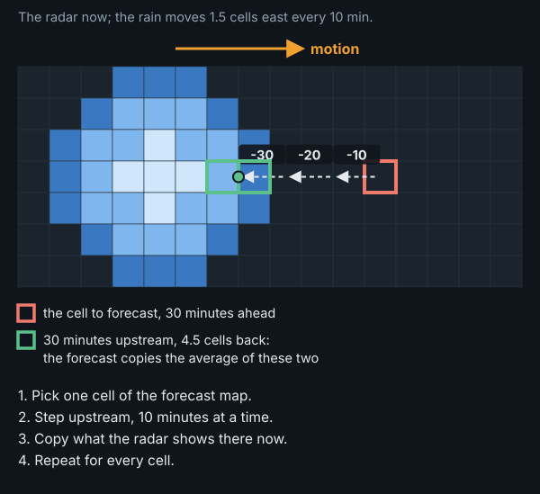

**The rain's strength** does not change: the simple methods and Lucas-Kanade keep the latest scan's intensities at every lead time, apart from a slight smoothing where a look-up lands between cells. S-PROG and STEPS keep the overall amount of rain about the same but let small showers fade and spread out.

**Where it goes wrong.** Looking upstream works well when the motion changes smoothly across the map. Where two neighbouring blocks have different vectors, forecast cells on either side of the block edge look upstream in different directions. Some rain in the radar scan is then never picked up by any cell (it is dropped), and some is picked up by two cells (it is copied twice, adding rain that was not there). This is why block matching forecasts more rain than the whole-map vector (section 5.3):

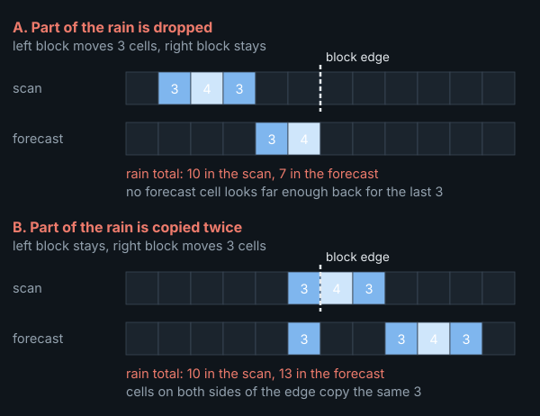

**At the map edge**, where rain would enter from beyond the map, the simple methods repeat the edge value and pysteps lets no rain in. This shows as vertical streaks along the edges of some forecasts in section 5.1, and may explain part of why pysteps' rain totals fall below the simple methods' at long lead times (Lucas-Kanade 0.94, whole-map vector 1.06 at +3 hours); this has not been checked.

## Appendix C. The chance of rain in depth

Section 5.5 gives the conclusions of this comparison; this appendix gives the details.

**Why a neighbourhood?** How long rain stays predictable grows with its size. Rain patterns of 0.2 to 200 km remain recognisable, once their motion is taken into account, for about 20 minutes ([Ruzanski and Chandrasekar, 2012](https://doi.org/10.1175/JAMC-D-11-069.1)); the growth and decay of rain is predictable for up to about 2 hours only for features larger than about 250 km ([Radhakrishna, Zawadzki and Fabry, 2012](https://doi.org/10.1175/JAS-D-12-029.1)). After an hour, a shower in the right area but not the right spot is about as much as extrapolation can deliver, so a single forecast is best read over a neighbourhood, and the best neighbourhood widens with lead time. The same holds for the spatial accuracy score, which is why it is computed over about 30 km (section 3.2).

**STEPS at its full defaults.** The STEPS run of section 5 has 8 members and no random perturbation of the motion field. With pysteps' defaults, 24 members and the motion perturbed, the probabilities improve a little: a Brier improvement of +0.0430 at +60 minutes and +0.0486 at +3 hours, against +0.0400 and +0.0420. Both changes contribute: the perturbation mostly at long leads (+0.0455 at +3 hours with 8 members), more members at every lead. The ensemble mean, on the other hand, places rain worse, with an FSS gain of +0.184 at +60 minutes against +0.224: perturbed members disagree more about where the rain goes, so their mean spreads it out. For the chance of rain STEPS' lead only grows at its defaults; for a single forecast, plain Lucas-Kanade stays the better choice.

**A fair comparison.** A single forecast can give a probability too: the share of its cells with rain within a window around each cell, a *neighbourhood probability*:

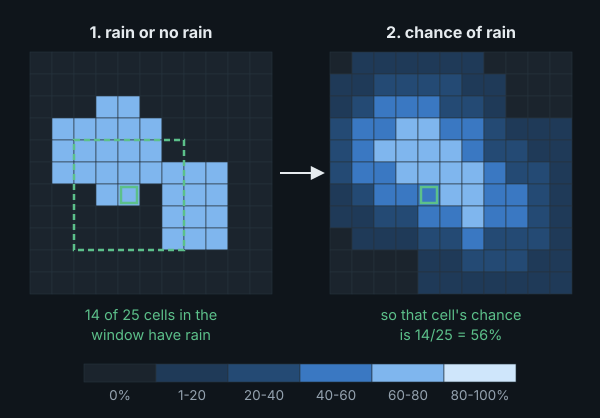

The figure uses a window of 5 x 5 cells, about 16 km; windows of about 10 to 80 km were tried, and a wider window gives smoother, more cautious chances.

STEPS' own probabilities were averaged over the same windows, and every forecast is still scored against the one cell. Brier improvement over persistence's own rain-or-no-rain forecast, with each method's best window in bold (`scripts/compare_probs.py`):

| Method | Lead | cell alone | 10 km | 16 km | 29 km | 48 km | 80 km |
|---|---|---|---|---|---|---|---|
| Block matching (1 h) | +60 | +0.0189 | +0.0323 | +0.0371 | +0.0408 | **+0.0417** | +0.0405 |
| Whole-map vector (30 min) | +60 | +0.0176 | +0.0302 | +0.0355 | +0.0401 | **+0.0416** | +0.0406 |
| pysteps Lucas-Kanade | +60 | +0.0226 | +0.0347 | +0.0393 | +0.0424 | **+0.0426** | +0.0408 |
| pysteps S-PROG | +60 | +0.0295 | +0.0351 | +0.0379 | +0.0405 | **+0.0413** | +0.0404 |
| pysteps STEPS, 8 members | +60 | +0.0400 | +0.0418 | +0.0428 | **+0.0435** | +0.0430 | +0.0411 |
| pysteps STEPS, 24 members (defaults) | +60 | +0.0430 | +0.0433 | **+0.0434** | +0.0433 | +0.0426 | +0.0409 |
| Block matching (1 h) | +180 | +0.0120 | +0.0265 | +0.0317 | +0.0378 | +0.0426 | **+0.0464** |
| Whole-map vector (30 min) | +180 | +0.0124 | +0.0247 | +0.0305 | +0.0372 | +0.0424 | **+0.0465** |
| pysteps Lucas-Kanade | +180 | +0.0161 | +0.0278 | +0.0332 | +0.0393 | +0.0438 | **+0.0472** |
| pysteps S-PROG | +180 | +0.0216 | +0.0253 | +0.0279 | +0.0322 | +0.0372 | **+0.0425** |
| pysteps STEPS, 8 members | +180 | +0.0421 | +0.0436 | +0.0444 | +0.0456 | +0.0470 | **+0.0484** |
| pysteps STEPS, 24 members (defaults) | +180 | +0.0486 | +0.0490 | +0.0492 | +0.0494 | +0.0495 | **+0.0496** |

- **STEPS' lead grows with lead time.** At +3 hours the single forecasts need ever wider windows: their gain is still rising at 80 km (Lucas-Kanade 0.0472, block matching 0.0464), and STEPS stays ahead (0.0496). With the windows that were best at +60 minutes, its lead over Lucas-Kanade grows from 0.0008 to 0.0054. An ensemble whose members spread apart as the forecast ages adapts to the growing uncertainty by itself; a single forecast needs the window widened by hand.
- **At +60 minutes the gap nearly closes.** With a window of about 48 km, Lucas-Kanade reaches 0.0426 and block matching 0.0417, against 0.0434 for STEPS at its defaults: its lead over Lucas-Kanade almost disappears.
- **The best window was picked on the same data.** At +60 minutes the gain of the single forecasts peaks at about 48 km and falls again at 80, and the peak is flat, so the exact choice matters little.

The same comparison as curves, with the reliability of the chances: how often it rained when a method gave a certain chance (on the diagonal = honest):

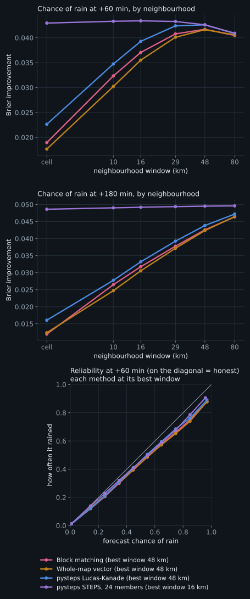

**How honest are the chances?** With each method at its best window, when the single forecasts give an 85% chance of rain it rains about 74% to 76% of the time, and with STEPS 79%: all of them overstate high chances somewhat, the single forecasts a little more. Read over a window too small for them, about 30 km, the single forecasts overstate far more (65% for block matching).

**A chance of rain at one spot, from one forecast.** The comparisons above score the map at a few lead times. A person at one place asks something narrower: will it rain here in ten minutes, in an hour, and when will it start or stop? To answer that, the whole-map vector's single forecast was turned into a simple probability model.

*The model.* At one place the main error of a moving-rain forecast is *where* the rain will be: the measured motion is slightly off, and the error grows with lead time. So the forecast is copied 40 times, and each copy is displaced by a random offset whose standard deviation grows in proportion to the lead time, by about one kilometre for every three minutes ahead: some 3 km at +10 minutes, 20 km at +1 hour and 40 km at +2 hours. Each copy keeps the direction of its offset at every lead time, so it is one consistent alternative future, in which the rain arrives a little earlier or later, or a little to one side. The chance of any statement, such as "rain here at +30 minutes" or "rain starts here within an hour", is the share of copies for which it comes true. The rate is read off the window widths that scored best at each lead time, chosen on one half of the season and scored on the other; both halves chose the same widths (`scripts/local_probs.py`, `scripts/local_timing.py` and their summaries).

*Scored* in every cell of the scoring area, from every issue time, against STEPS at its defaults (24 members) calibrated on the other half of the season, at 0.5 mm/h; 0.1 mm/h gives the same picture. First the chance of rain at each moment ahead:


- **One hour ahead the model is close to STEPS, two hours ahead level with it:** a Brier improvement over persistence of 0.042 against 0.043 at +60 minutes, and 0.047 against 0.047 at +2 hours. STEPS keeps a small lead in the first half hour (0.026 against 0.024 at +10 minutes). The same forecast read as rain or no rain reaches only 0.018 at +60 minutes.

Then statements about timing, for 30 minutes, 1 hour and 2 hours ahead: *rain starts within* (where it is dry now), *rain within* (anywhere), and *dry for good within*, meaning no rain from then until +2 hours (where it is raining now):

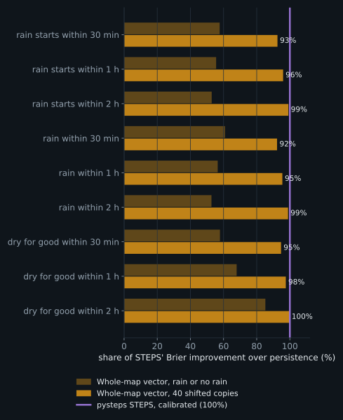

- **The model reaches 92 to 100% of STEPS' improvement:** 96% for "rain starts within an hour" and 99% within two hours, where the two do not differ significantly. The forecast read as rain or no rain reaches about half.

*What did not help.* Stretching the offsets along the motion, adding the forecasts of the last half hour as extra copies, and calibrating the model's chances changed nothing or made them worse: its chances are honest as they are. For timing, treating each lead time separately instead of keeping each copy coherent does clearly worse at longer horizons.

**And cell size?** Everything in this appendix was run on the 3.2 km grid only; finer grids were not tested. The expectation, from the cell-size study (Appendix B.2) rather than from a measurement, is that the conclusions do not change. A neighbourhood probability is the rainy share of an area in kilometres, and a finer grid only samples the same area more finely; judged over about 30 km, cell size changes rain placement by less than 0.01 for every method. What would change is the cell-by-cell score: a smaller cell is a smaller target, wet less often and harder to hit exactly, so a forecast that can only say rain or no rain would fall further behind STEPS there, the built-in advantage this fair comparison removes. The radar truth also becomes patchier on a finer grid, so Brier values are comparable between grids only as improvements over persistence. For someone at one spot, a finer grid gives the chance for a smaller place, but how far rain is typically misplaced within an hour keeps the useful window at tens of kilometres.

## Appendix D. Uncertainty and robustness

D.1 explains the 95% intervals used throughout the report. D.2 to D.4 are the robustness checks summarised in section 6: the results by month, with coarser resampling units, and with settings chosen on held-out months. D.5 gives the full result tables behind section 5.

### D.1 How the intervals are made

Every score in this report comes from a limited sample of rain: 157 rain episodes. A different six months would give somewhat different numbers, and the 95% intervals show by how much. They come from a *bootstrap*, which imitates having observed a different sample of rainy periods by drawing again from the ones we have:

1. Take the 157 rain episodes.
2. Draw 157 of them at random, *allowing repeats*. Some episodes appear twice or three times and about a third are left out: a new sample, similar to the real one but not the same.
3. Compute the score on that sample, exactly as on the real one.
4. Repeat 2,000 times. Leaving out the lowest and the highest 2.5% of the 2,000 scores, the range of the rest is the *95% interval*.

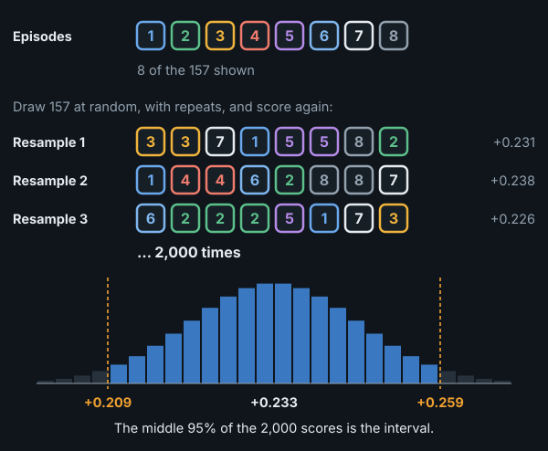

For example, pysteps Lucas-Kanade improves on persistence by +0.233 at +60 minutes, with a 95% interval of [+0.209, +0.259]: with another sample of similar rain, the gain would very likely fall in that range.

**Why episodes, not single forecasts.** Forecasts issued an hour apart within one rainy period share the same weather: if a method struggles with that weather, it struggles in all of them. Resampling single forecasts would treat them as independent evidence and give intervals that are far too narrow; the rain episode is the unit that is roughly independent.

**Comparing two methods.** When two methods are compared, each of the 2,000 samples uses the *same* episodes for both and records the difference. A difficult period then counts against both at once, so the interval shows how consistently one method beats the other; an interval that does not include 0 means the difference is statistically significant. The report also gives the share of individual episodes in which one method beats the other. When that share and the pooled difference disagree, a few very rainy episodes are driving the pooled number.

**A caveat.** Episodes cut from one long rainy spell are still related to each other, so the intervals may be somewhat too narrow; resampling whole days or spells instead changes no conclusion (Appendix D.3).

### D.2 By month

FSS gain over persistence at +60 minutes, by month of the rain episode:

| Month | Rain episodes | Persistence FSS | Block matching | Whole-map vector | pysteps Lucas-Kanade | pysteps STEPS mean |
|---|---|---|---|---|---|---|
| April | 19 | 0.67 | +0.131 | +0.121 | +0.133 | +0.129 |
| May | 24 | 0.67 | +0.164 | +0.154 | +0.175 | +0.140 |
| June | 34 | 0.52 | +0.277 | +0.266 | +0.302 | +0.290 |
| July | 27 | 0.60 | +0.218 | +0.210 | +0.236 | +0.229 |
| August | 24 | 0.59 | +0.224 | +0.219 | +0.241 | +0.245 |
| September | 29 | 0.57 | +0.225 | +0.225 | +0.247 | +0.238 |

Every method gains in every month. In April and May persistence scores high (its own FSS is about 0.67, against 0.52 to 0.60 in summer), so there is less to gain. The reason was not investigated. Slower rain and different weather types are plausible: across Europe, convective rain in summer is more common over land, where it follows the daytime heating, while over the seas it shows little daily cycle ([Lombardo and Bitting, 2024](https://doi.org/10.1175/MWR-D-23-0156.1)), so the mix of rain carried in from the sea and showers formed over land shifts through the season. pysteps leads in every month, Lucas-Kanade in five of the six and the STEPS mean in August (figure in section 6).

### D.3 Wider resampling units

The intervals in this report resample rain episodes (Appendix D.1), which may be too fine a unit (the caveat in D.1). Two coarser units were tried instead: whole calendar days (UTC), and whole rainy spells, with episodes less than 3 hours apart merged. The 157 episodes form 104 days and 63 spells. The figure shows the 95% interval of each comparison under each unit, drawn around its own estimate (given under each label) so the interval sizes can be compared directly; the dashed line marks where a difference of 0 lies, when it falls on the chart (FSS over about 30 km, `scripts/robustness.py`; its random draws differ from section 5's, so the episode intervals can differ in the third decimal):

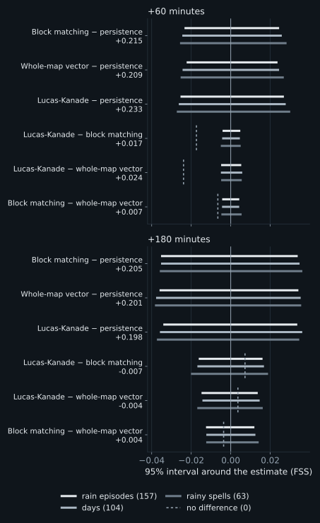

Spells widen the intervals by a median of 11%, and no interval widens by more than 21%. Every difference that is significant with episodes stays significant with days and with spells, and none that is not becomes significant.

### D.4 Settings chosen on other months

Some settings were chosen on the same data they are scored on (section 5). To test how much that flatters them, each was chosen again on April to June only, by its FSS gain over persistence at +60 minutes, and scored on July to September, and the other way round. The *regret* is how much the held-out half loses against the setting that would have been best on it.

| Setting | Section 5 uses | Chosen on Apr–Jun | Its gain on Jul–Sep (regret) | Chosen on Jul–Sep | Its gain on Apr–Jun (regret) |
|---|---|---|---|---|---|
| Block matching: history | 1 h | 2 h | +0.223 (0.000) | 2 h | +0.208 (0.000) |
| Whole-map vector: history | 30 min | 30 min | +0.219 (0.000) | 40 min | +0.195 (0.000) |
| pysteps Lucas-Kanade: history | 30 min | 30 min | +0.241 (0.000) | 30 min | +0.221 (0.000) |
| Whole-map vector: own matches or repaired field | own matches | own matches | +0.219 (0.000) | own matches | +0.195 (0.000) |
| Block matching: block size | 26 km | 26 km | +0.219 (0.008) | 102 km, blended | +0.196 (0.000) |

- **History, and how the whole-map vector is built, carry over between the halves:** the regret is at most 0.0002. Both halves pick 2 hours of history for block matching, a little more than the hour used in section 5, which scores almost the same on either half.
- **Block size is the exception.** Chosen on April to June, the 26 km blocks lose 0.008 on July to September against blended 102 km blocks; chosen on July to September, the blended 102 km blocks lose nothing on April to June. Either way, block size matters little (Appendix B.3).

The methods, each at the history chosen on the other half, compared on the held-out half alone:

| Comparison, +60 min | Held out: Jul–Sep (80 episodes) | Held out: Apr–Jun (77 episodes) |
|---|---|---|
| pysteps Lucas-Kanade − block matching | +0.018 [+0.013, +0.024] | +0.012 [+0.006, +0.018] |
| pysteps Lucas-Kanade − whole-map vector | +0.023 [+0.017, +0.030] | +0.026 [+0.018, +0.033] |
| Block matching − whole-map vector | +0.004 [-0.001, +0.009] | +0.013 [+0.007, +0.020] |

pysteps Lucas-Kanade stays significantly ahead of both simple methods on either half. Block matching is ahead of the whole-map vector on both, significantly on April to June but not on July to September.

### D.5 Full result tables

All the scores at +60 minutes (section 3.2; CSI as in section 5.6, here cell by cell over the map):

| Model type | Method | FSS | FSS gain over persistence [95% CI] | CSI 0.5 | Rain ratio | Brier improvement |
|---|---|---|---|---|---|---|
| Reference | Persistence (nothing moves) | 0.59 | (reference) | 0.20 | 1.00 | (reference) |
| Simple motion | Block matching | 0.81 | +0.215 [+0.193, +0.239] | 0.35 | 1.08 | +0.0189 |
|  | Whole-map vector | 0.80 | +0.209 [+0.188, +0.232] | 0.33 | 1.04 | +0.0176 |
| State of the art | pysteps Lucas-Kanade | 0.83 | +0.233 [+0.209, +0.259] | 0.37 | 1.04 | +0.0226 |
|  | pysteps S-PROG | 0.82 | +0.223 [+0.199, +0.248] | 0.42 | 0.98 | +0.0295 |
|  | pysteps STEPS, ensemble mean | 0.82 | +0.224 [+0.201, +0.248] | 0.42 | 0.94 | +0.0400 |

FSS gain over "nothing moves" at every lead time to 3 hours:

| Model type | Method | +30 min | +60 min | +90 min | +120 min | +180 min |
|---|---|---|---|---|---|---|
| Reference | *Persistence FSS* | 0.78 | 0.59 | 0.48 | 0.39 | 0.28 |
| Simple motion | Block matching | +0.133 | +0.215 | +0.238 | +0.235 | +0.205 |
|  | Whole-map vector | +0.133 | +0.209 | +0.227 | +0.225 | +0.201 |
| State of the art | pysteps Lucas-Kanade | +0.143 | +0.233 | +0.254 | +0.244 | +0.198 |
|  | pysteps S-PROG | +0.139 | +0.223 | +0.241 | +0.230 | +0.184 |
|  | pysteps STEPS, ensemble mean | +0.136 | +0.224 | +0.247 | +0.242 | +0.202 |

The methods head to head, on exactly the same rain episodes: *A − B* is the difference in FSS with its 95% interval, and *episodes where A is better* counts the individual episodes A wins:

| A | B | A − B, +60 min [95% CI] | Episodes where A is better, +60 | A − B, +180 min [95% CI] | Episodes where A is better, +180 |
|---|---|---|---|---|---|
| pysteps Lucas-Kanade | Whole-map vector | +0.024 [+0.019, +0.029] | 92% | -0.004 [-0.019, +0.010] | 60% |
| pysteps Lucas-Kanade | Block matching | +0.017 [+0.013, +0.022] | 86% | -0.007 [-0.023, +0.009] | 54% |
| Block matching | Whole-map vector | +0.007 [+0.002, +0.011] | 61% | +0.004 [-0.009, +0.016] | 53% |

Rain at the five cities in the second hour (60 to 120 minutes):

| Model type | Method | Rainy hours caught | False alarms | CSI [95% CI] | Typical error (mm) | Rain total ratio |
|---|---|---|---|---|---|---|
| Reference | Persistence (nothing moves) | 31% | 64% | 0.20 [0.17, 0.23] | 0.33 | 1.02 |
| Simple motion | Block matching | 47% | 47% | 0.33 [0.29, 0.37] | 0.23 | 0.92 |
|  | Whole-map vector | 45% | 47% | 0.32 [0.28, 0.36] | 0.22 | 0.86 |
| State of the art | pysteps Lucas-Kanade | 48% | 43% | 0.35 [0.31, 0.39] | 0.22 | 0.89 |

CSI for the next hour, city by city:

| City | Hours with rain | Persistence | Block matching | Whole-map vector | pysteps Lucas-Kanade |
|---|---|---|---|---|---|
| Copenhagen | 269 | 0.35 | 0.49 | 0.48 | 0.50 |
| Aarhus | 185 | 0.40 | 0.57 | 0.59 | 0.62 |
| Odense | 181 | 0.38 | 0.59 | 0.59 | 0.62 |
| Aalborg | 108 | 0.34 | 0.59 | 0.54 | 0.55 |
| Esbjerg | 162 | 0.39 | 0.63 | 0.57 | 0.63 |

## Appendix E. Reproducing this

Everything is in this repository. Data and virtual environment are git-ignored. `--stride 2` (the default) is the 10-minute axis of full-range scans; `--stride 1` uses every scan. `scripts/backfill.py --regrid` rebuilds the grids from the raw files already on disk.

```
# Set-up and data
python3 -m venv .venv && . .venv/bin/activate
pip install -e . pytest pysteps opencv-python-headless markdown cairosvg
python scripts/backfill.py 2026-04-01 2026-09-23        # about 4.5 GB raw scans, about 90 min
python scripts/build_index.py                            # memory-mappable day files, about 7 GB
pytest

# Section 5 and Appendix B.1: main benchmark (about 35 min on 12 cores), history and long leads (about 15 min)
python scripts/run_eval.py --events fine --every 6 --hist 7 --leads 30,60,90,120,180 \
    --models persistence,block,block-windows,global-windows,global-windows-smoothed,pysteps-lk,pysteps-lk7,pysteps-sprog,pysteps-steps \
    --out results/benchmark-10min.jsonl
python scripts/run_eval.py --events fine --every 6 --hist 13 --leads 30,60,90,120,180,240,360 \
    --models persistence,block-windows,global-windows,pysteps-lk,pysteps-lk7,pysteps-lk13 --out results/benchmark-10min-window.jsonl
python scripts/run_cities.py && python scripts/run_cities.py --update bw7   # section 5.6, about 10 min
python scripts/run_eval.py --issues-from results/benchmark-10min.jsonl --hist 7 --leads 30,60,90,120,180 \
    --models persistence,pysteps-steps-bps,pysteps-steps-default --out results/steps-defaults.jsonl   # Appendix C, STEPS at its defaults

# Appendices B.1 and B.4: motion statistics
python scripts/motion_stats.py

# Appendix B.1: history in steady and turning flow (needs data/era5 from scripts/fetch_era5.py)
python scripts/turning_flow.py

# Appendix C: a chance of rain at one spot (every cell, every 10 minutes to +2 h; about 30 min on 20 cores)
python scripts/local_probs.py 20 && python scripts/local_probs_summary.py
# Appendix C: timing at one spot (about 25 min on 22 cores)
python scripts/local_timing.py 22 && python scripts/local_timing_summary.py

# Appendix A.2: scans 5 or 10 minutes apart
python scripts/run_eval.py --stride 2 --region common --events fine --every 6 --hist 7 --leads 30,60,90,120,180 \
    --models persistence,block,block-windows,global-windows,pysteps-lk,pysteps-lk7 --out results/check-cadence-10min.jsonl
python scripts/run_eval.py --stride 1 --region common --issues-from results/check-cadence-10min.jsonl --hist 13 \
    --leads 30,60,90,120,180 --models persistence,block,block-windows,global-windows,pysteps-lk,pysteps-lk7,pysteps-lk13 \
    --out results/check-cadence-5min.jsonl

# Appendix A.3: fixed echoes
python scripts/climatology.py && python scripts/fixed_echo_mask.py
python scripts/run_eval.py --region clean --issues-from results/benchmark-10min.jsonl --hist 7 --leads 30,60,90,120,180 \
    --models persistence,block,global-windows,pysteps-lk,pysteps-lk7,pysteps-sprog,pysteps-steps --out results/benchmark-clean.jsonl
python scripts/run_cities.py --half 2 --out results/cities-5x5.jsonl
python scripts/run_cities.py --half 2 --region clean --out results/cities-5x5-clean.jsonl
python scripts/motion_stats.py 10 clean && python scripts/compare_mask.py > results/REPORT-fixed-echo.md

# Appendix B.2: cell size (builds the 2 and 1 km archives and reruns on each grid; hours)
bash scripts/run_grid_study.sh

# Appendix B.3: block size, tracked motion, station winds
python scripts/motion_coherence.py && python scripts/fetch_station_wind.py && python scripts/station_vs_rain.py
python scripts/fetch_era5.py && python scripts/era5_vs_rain.py   # winds aloft (needs a CDS account and ~/.cdsapirc)
python scripts/fetch_gauges.py && python scripts/radar_vs_gauges.py   # Appendix A.4, radar against rain gauges
python scripts/run_eval.py --issues-from results/benchmark-10min.jsonl --hist 7 --leads 30,60,90,120,180 \
    --models persistence,block,block-13km,block-51km,block-102km,block-smooth-13km,block-smooth-26km,block-smooth-51km,block-smooth-102km,global-windows \
    --out results/blocksize-3.2km.jsonl                   # and NOWCAST_GRID=2km ... --out results/blocksize-2km.jsonl

# Appendix B.4: speed, speed-ups and sub-cell matching (subcell.jsonl: the same with block-sub,global-windows-sub; both also on the
# cadence check's issue times, with its --stride/--region/--hist, -> subcell[-all]-cadence-10min/5min.jsonl)
python scripts/vector_speed.py
python scripts/run_eval.py --issues-from results/benchmark-10min.jsonl --hist 7 --leads 30,60,90,120,180 \
    --models persistence,global-scaled --out results/speed-scaling.jsonl
python scripts/run_eval.py --issues-from results/benchmark-10min.jsonl --hist 7 --leads 30,60,90,120,180 \
    --models persistence,block-sub-all,global-windows-sub-all --out results/subcell-all.jsonl
python scripts/run_cities.py --out results/cities.jsonl --update block-sub-all && python scripts/subcell_cities.py   # sub-cell matching at the cities

# Numbers quoted in the text, figures, report
python scripts/explain_checks.py
python scripts/robustness.py                             # Appendix D.3 and D.4: resampling units, held-out months
python scripts/run_eval.py --issues-from results/benchmark-10min.jsonl --hist 7 --leads 30,60,90,120,180 --neighbourhood \
    --models persistence,block-windows,global-windows,pysteps-lk,pysteps-sprog,pysteps-steps,pysteps-steps-default \
    --out results/probs.jsonl && python scripts/compare_probs.py   # section 5.5 and Appendix C, neighbourhood probabilities
python scripts/make_schematics.py && python scripts/make_result_figures.py && python scripts/make_case_figures.py
python scripts/build_report.py && python scripts/build_page.py
```

| Path | What |
|---|---|
| `src/nowcastlab/radar.py` | Radar file to rain-rate grid (no data stays missing) |
| `src/nowcastlab/data.py` | The archive as a time axis: full-range scans every 10 minutes by default |
| `src/nowcastlab/grid.py` | The analysis grid: cell size set with `NOWCAST_GRID` (3.2km, 2km or 1km); sizes in km converted to cells |
| `src/nowcastlab/motion.py`, `models.py` | Motion estimation and all forecasting methods behind one interface |
| `src/nowcastlab/evaluate.py`, `metrics.py`, `report.py` | Hindcast harness, scores, rain-episode bootstrap |
| `scripts/` | Download, benchmark, figures, report and page builders |
| `docs/REPORT.template.md`, `docs/REPORT.md` | This report: template and generated text (numbers are filled from `results/`) |
| `results/` | Scored forecasts (`*.jsonl`) and the tables built from them |

## Appendix F. Glossary

- **Nowcast**: a forecast for the next minutes to hours.
- **Scan**: one radar image. DMI makes one every 5 minutes, alternating full-range and doppler; this report uses the full-range ones, every 10 minutes.
- **Lead time**: how far ahead the forecast looks; "+60" is 60 minutes after the issue time.
- **Issue time**: the moment the forecast is made; only scans up to then may be used.
- **Hindcast**: forecasting a past moment using only what was known then, so the forecast can be scored.
- **Persistence**: the reference forecast that the latest scan stays unchanged.
- **Motion vector**: how far, and in which direction, the rain moves per time step.
- **Block matching**: finding where each block of one scan went in the next; one motion vector per block (section 4.2).
- **Whole-map vector**: one motion vector for the whole map, the confidence-weighted mean of the blocks' matches (section 4.3).
- **Sub-cell matching**: refining a whole-cell match to a fraction of a cell (Appendix B.4).
- **Optical flow**: estimating a motion vector at every point of an image sequence.
- **S-PROG, STEPS**: pysteps methods that let small-scale detail fade with lead time; STEPS adds random noise to make an ensemble (section 4.4).
- **Ensemble**: several forecasts, each an equally likely possibility.
- **Rain episode**: a rainy period of at most 12 hours, the unit of independent evidence in the scoring.
- **FSS, Brier score, rain ratio**: see section 3.2. How FSS is computed: for every cell, the share of wet cells in its neighbourhood is taken for the forecast and for the radar; the squared differences between the two are added up over the map (the *mismatch*), as are the squares of both shares (the *reference*, the largest the mismatch could be); FSS is 1 minus mismatch divided by reference. Scores are pooled: mismatches and references of all forecasts in a group are added up before dividing, so rainy forecasts, with more to get right or wrong, weigh more than nearly dry ones.
- **CSI**, critical success index: hits divided by hits, misses and false alarms; see section 5.6.
- **Skill**: how much better a forecast is than persistence.
- **Fixed echo**: a radar signal that looks like rain but stays put, from structures, turbines or the ground (Appendix A.3).
- **Cloud-layer wind**: the mean wind between about 1.5 and 9 km up, which carries rain cells (Appendix B.3).
- **Propagation**: movement of a storm by new cells forming on one side and old ones dying on the other, as opposed to drift with the wind (Appendix B.3).
- **Low**: a low-pressure system, also called a depression, typically several hundred to a thousand km across; in the northern hemisphere the wind circulates around it anticlockwise, so as it passes the wind keeps changing direction and the flow carrying the rain is curved.
- **Front**: the boundary between two air masses, usually trailing from a low. Rain often lines up along it in a band, and the wind turns as it passes: over Denmark a cold front typically turns it from south-westerly to westerly or north-westerly.
- **Convective rain**: showers and thunderstorms from rising warm air, usually small and short-lived; the opposite is widespread, longer-lasting rain from large weather systems.
